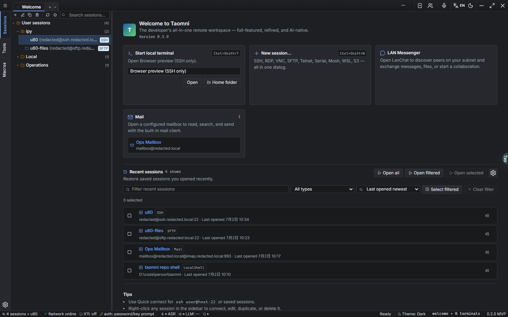
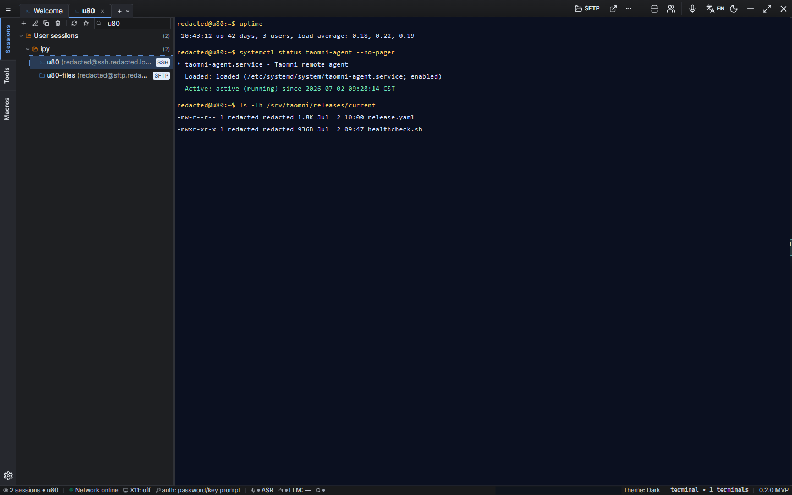
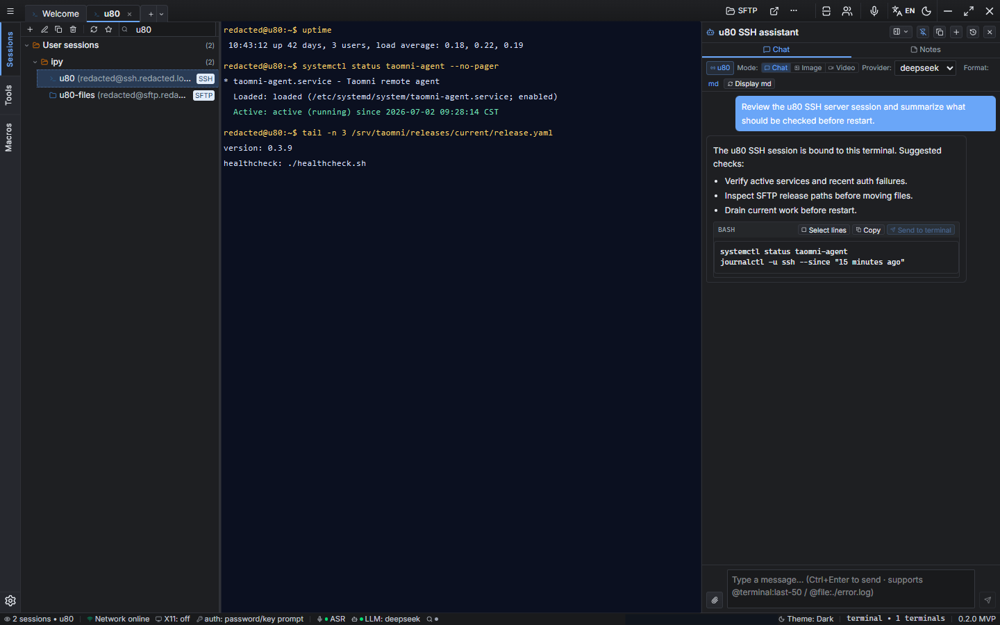
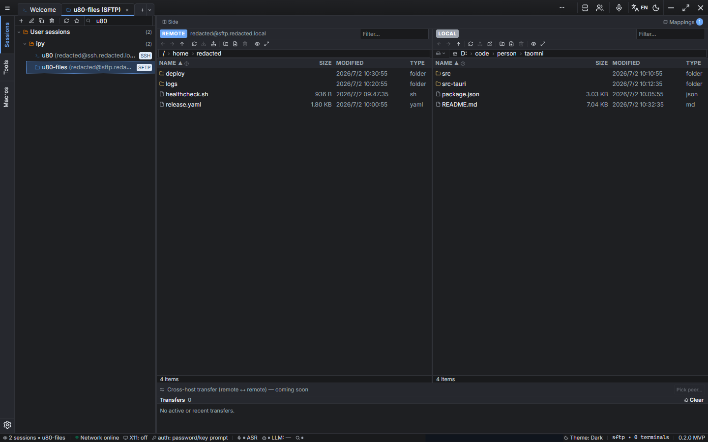
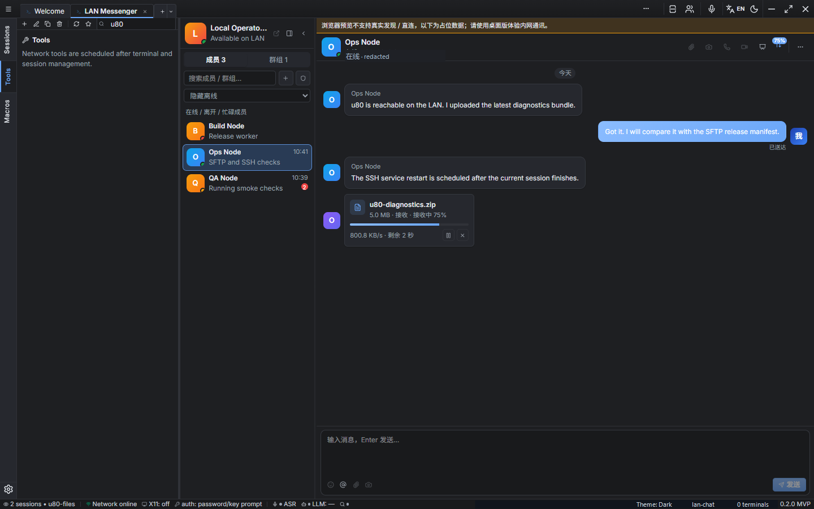
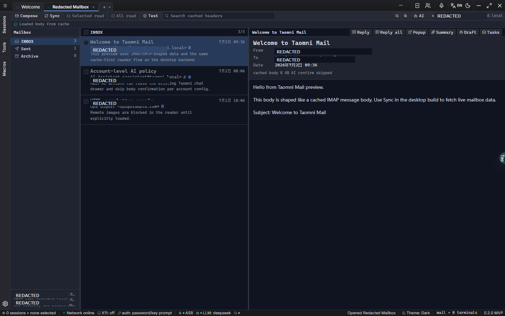
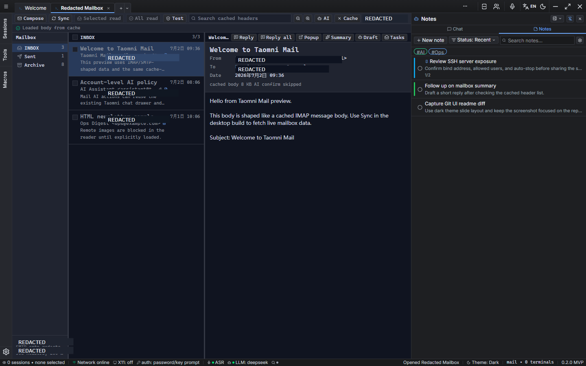
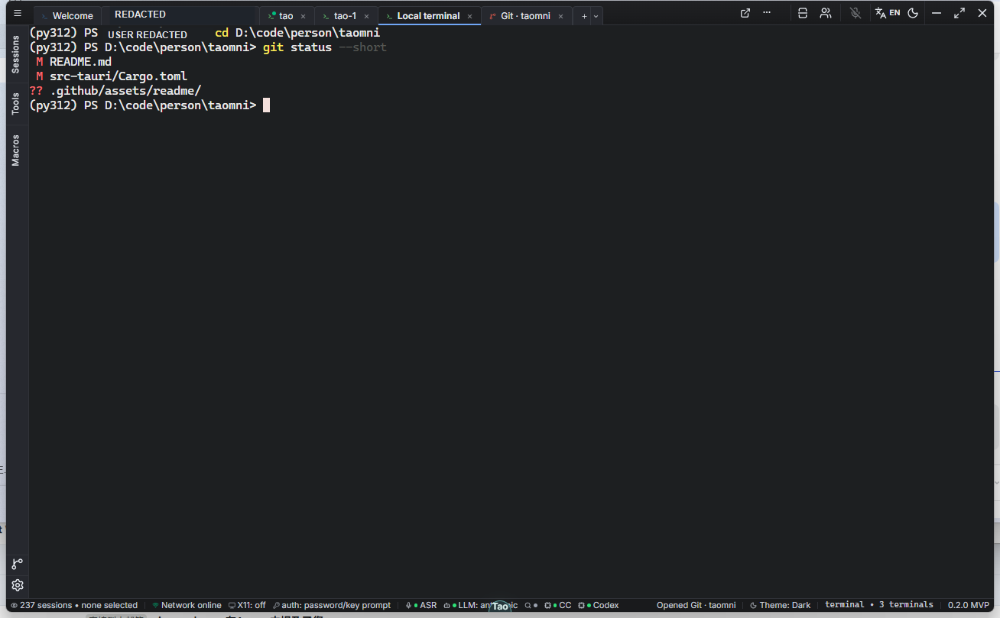
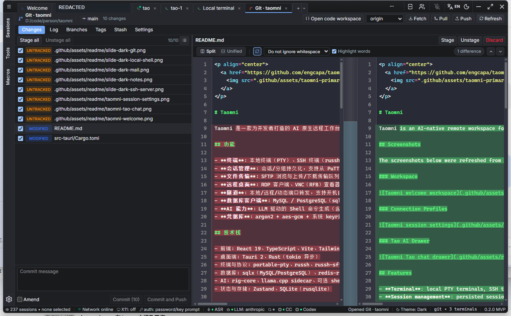
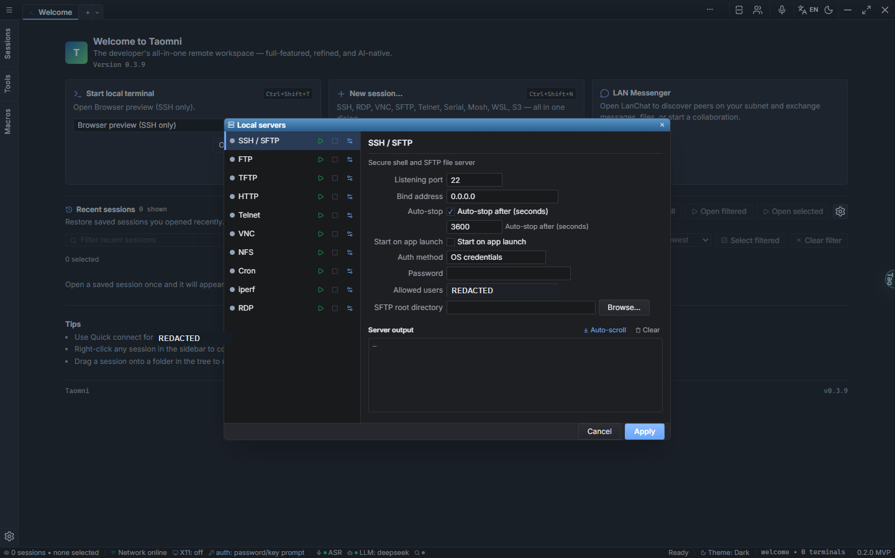

<p align="center">
  <a href="https://github.com/engcapa/taomni">
    
  </a>
</p>

# Taomni

Taomni is an AI-native remote workspace for developers. It is built with Tauri 2, React 19, TypeScript, and Rust, and is designed to run across Linux, macOS, and Windows. The app brings local terminals, SSH, SFTP, RDP/VNC, tunnels, database clients, mail, and AI-assisted workflows into one compact desktop workspace.

## Screenshots

Dark-mode slide gallery captured from local dev builds, including the `5000` browser preview and the desktop app window. Account names, email addresses, LAN addresses, and SSH user fields are redacted. Slides are kept compact for easier README scanning.

<div align="center">

<p><strong>Slide 01 - Welcome and Recent Sessions</strong></p>



<p><strong>Slide 02 - u80 SSH Session</strong></p>



<p><strong>Slide 03 - Tao AI Chat Bound to u80 SSH</strong></p>



<p><strong>Slide 04 - SFTP Browser</strong></p>



<p><strong>Slide 05 - LAN Messenger</strong></p>



<p><strong>Slide 06 - Mail Workspace</strong></p>



<p><strong>Slide 07 - Tao Notes</strong></p>



<p><strong>Slide 08 - Local Shell</strong></p>



<p><strong>Slide 09 - Git UI</strong></p>



<p><strong>Slide 10 - Local Servers</strong></p>



</div>

## Features

- **Terminal**: local PTY terminals, SSH terminals through `russh`, proxy support, and single-hop SSH jump hosts.
- **Session management**: persisted sessions and groups, with import support for PuTTY, WSL, Tabby, and OpenSSH configuration.
- **File transfer**: SFTP browsing plus upload and download transfer queues.
- **Remote desktop**: RDP client, VNC/RFB viewer, and a built-in RDP server mode.
- **Tunnels**: local, remote, and dynamic port forwarding with optional startup behavior.
- **Database clients**: MySQL, PostgreSQL, SQL Server, StarRocks, ClickHouse, Presto, Redis, and a native HBase shell/RPC client, with proxy and SSH jump-host routing.
- **Mail workspace**: IMAP/SMTP session profiles and mail-oriented workflows.
- **AI workflows**: LLM-powered shell command generation with safety review, agent tool execution, web search, chat, tab completion, and ASR voice input.
- **Credential vault**: encrypted credential storage using `argon2`, `aes-gcm`, and the system keyring.

## Tech Stack

- **Frontend**: React 19, TypeScript, Vite, Tailwind CSS, xterm.js, CodeMirror 6.
- **Desktop/backend**: Tauri 2 and Rust with async `tokio`.
- **Terminal and protocols**: `portable-pty`, `russh`, `russh-sftp`, `ironrdp`, and a custom RFB/VNC implementation.
- **Databases**: `sqlx`, `redis-rs`, and native HBase support with `prost` and ZooKeeper.
- **AI**: `rig-core`, a `llama.cpp` sidecar, and optional `sherpa-onnx` speech transcription.
- **State and storage**: Zustand and SQLite through `rusqlite`.

## Requirements

- Node.js 18+
- pnpm
- Rust 1.94+
- `protoc` for Protocol Buffers, required by the native HBase client build
- Tauri system dependencies, including WebView2 on Windows and WebKitGTK on Linux

Install dependencies:

```bash
pnpm install
```

## Development

Run the browser-only Vite preview:

```bash
pnpm dev
```

The browser preview listens on `http://localhost:5000` and uses the Tauri API stubs in `src/stubs/`.

Run the full desktop app:

```bash
pnpm tauri dev
```

Tauri dev mode uses `http://localhost:1980` as configured in `src-tauri/tauri.conf.json` and `vite.config.ts`.

## Build and Package

Build frontend assets into `dist/`:

```bash
pnpm build
```

Build and package the desktop app:

```bash
pnpm tauri build
```

The Tauri command runs the frontend build first, then generates desktop bundles for the current platform. Bundle artifacts are usually written under:

```text
src-tauri/target/release/bundle/
```

Release executables can also be found under:

```text
src-tauri/target/release/
```

## Versioning and Releases

The application version is maintained in the root `package.json` `version` field. `src-tauri/tauri.conf.json` reads the same version from `../package.json`, so the frontend package and Tauri bundle stay aligned.

The `version` field in `src-tauri/Cargo.toml` is Rust crate metadata. Unless the Rust crate itself is being published or backend code needs `CARGO_PKG_VERSION`, application releases should use the root `package.json` version.

Release tags use the `v<version>` format and must match `package.json`. For example, version `0.3.9` maps to:

```bash
git tag v0.3.9
git push origin v0.3.9
```

GitHub Actions builds desktop bundles when a `v*` tag is pushed, a GitHub Release is published, or the `Release Bundle` workflow is run manually. Release-triggered builds validate that the tag equals `v` plus the `package.json` version. Manual runs without a tag only produce workflow artifacts; manual runs with a tag upload artifacts to the matching Release.

## Testing

Run frontend and unit tests:

```bash
pnpm test
```

Run Rust tests:

```bash
cd src-tauri
cargo test
```

UI workflow coverage lives in `qa-ui-auto-tests/`, with YAML cases under `qa-ui-auto-tests/cases/`.

## Project Layout

```text
src/                    React frontend code
src/components/         UI components
src/layouts/            Application shells
src/lib/                IPC clients and shared utilities
src/stores/             Frontend state stores
src/stubs/              Browser-only Tauri API stubs
src/test/               Vitest setup
src-tauri/              Tauri/Rust backend
src-tauri/src/          Rust modules
src-tauri/tests/        Rust integration tests
qa-ui-auto-tests/       UI automation assets and testcase YAML
```
