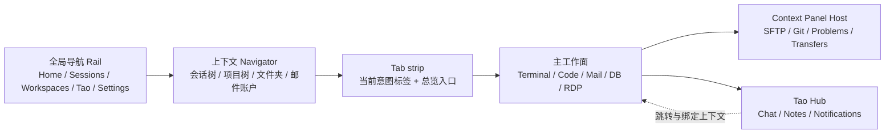

# Taomni 统一工作台壳层与布局易用性重构设计

> 设计状态：草案（原型 v1，待用户评审）  
> 文档：`docs-feature/workspace-shell-ux-redesign-design.md`  
> 原型：[`workspace-shell-ux-redesign-demo.html`](./workspace-shell-ux-redesign-demo.html)

## 1. 设计摘要与范围

本设计重构 Taomni 的桌面工作区外壳，解决“功能越来越多，但入口、标签、侧边栏和悬浮面板互相争夺空间”的问题。推荐采用 **统一工作台壳层 + 按工作意图分组的标签 + 上下文工具面板 + Tao 跨上下文中枢**：连接类会话、代码/数据工作区、邮件等保持自己的主工作面；SFTP、Git、问题列表等跟随当前工作面进入可停靠的上下文面板；Chat、Notes、Notifications 统一留在 Tao Hub 中，通过链接跳转到具体工作面。

本轮只交付设计文档和 HTML 原型，不修改 `src/`、`src-tauri/` 或测试，不创建实施任务卡，也不拆分开发任务。文档中的 AC/V 是后续实现和验收的契约，当前均为待执行。原型只用于评审信息架构、入口和交互层级，不能视为产品实现或桌面验证结果。

### 1.1 目标

- 首次打开能在 3 秒内找到“新建连接、打开工作区、继续上次工作”三个主动作。
- 多标签时可以通过名称、类型、工作区和内容预览定位，不依赖连续点击或记忆标签位置。
- 让每个面板有明确的归属：主工作面、上下文工具面板、Tao 跨上下文面板三者互不混淆。
- 窗口标题栏只保留高频、全局、当前上下文相关的动作；二级操作进入明确命名的菜单。
- Windows、macOS、Linux 使用同一信息架构，适配原生窗口按钮、WebView 尺寸和窄窗口降级。

### 1.2 非目标

- 本轮不改变 SSH、数据库、邮件、VNC/RDP、Git、SFTP、Code Workspace 的业务协议、数据格式和后端能力。
- 本轮不把所有功能合并为一个 Tao 页面；Tao 只承担跨上下文的 Chat、Notes、Notifications 和跳转能力。
- 本轮不规定视觉品牌重做、图标库替换或新增第三方 UI 依赖。
- 本轮不强行移除现有的分屏、标签拖拽、标签重命名、标签过滤、脱离窗口能力；这些能力在新壳层中重新归位。

### 1.3 调研基线

- 当前提交：`fd612966`。
- 当前环境日期：2026-10-03，工作区无未提交变更。
- 资料边界：只读取当前分支源码和仓库 `AGENTS.md`，没有引用其它分支的设计结论。
- 运行方式：Windows、macOS、Linux 三端 Tauri 2 桌面应用；浏览器预览只用于原型和辅助验证。
- 当前端真机：本轮为设计阶段，未执行；后续实现需按三端分别记录结果。

## 2. 当前实现与功能缺口

| 位置与符号 | 当前事实 | 本次影响 | 确定性 |
|---|---|---|---|
| `src/types/index.ts:9` `TabKind` | 当前类型包含 `terminal`、`sftp`、`rdp`、`vnc`、`database`、`git`、`mail`、`mail-unified`、`code-workspace`、`lan-chat`、工具类和 `welcome` 等多种类型。 | 类型数量已经超过平铺标签适合承载的范围，需要增加“按意图分组”和“主工作面/上下文面板”的展示语义。 | 源码事实 |
| `src/types/index.ts:425` `Tab` | 标签有 `id/type/title/sessionId/closable` 和各类型详情；部分类型已有 `sourceWorkspaceInstanceId` 等关联字段。 | 复用连接和持久化数据，新增展示层字段或派生映射，不改变现有业务字段。 | 源码事实 |
| `src/stores/appStore.ts:148-287` `AppState` | 有 `tabs`、`activeTabId`、`sidebarCollapsed`、按组恢复的侧栏状态、`tabFilter`、终端分屏、多执行等状态。 | 现有侧栏折叠、过滤和分屏要迁移到新壳层的明确区域，避免两个状态模型并存。 | 源码事实 |
| `src/layouts/MainLayout.tsx:732` `MainLayout` | 内容区按类型并行挂载 Terminal、SFTP、Git、Code Workspace、Mail、DB、RDP/VNC 等，切换时多数面板保持挂载。 | 保持长查询、传输和连接生命周期；只替换外层容器和面板归属。 | 源码事实 |
| `src/components/tabbar/ControlBar.tsx:76` `ControlBar` | 同一标题栏同时承载应用菜单、TabBar、详情按钮、`...`、截图、分屏、多执行、PTT、语言、主题、更新和窗口按钮。 | 需要按“导航 / 当前上下文 / 全局 / 系统窗口”分组，减少无语义图标并列。 | 源码事实 |
| `src/components/tabbar/TabBar.tsx:89` `TabBar` | 支持滚动标签、图标、关闭、拖拽、重命名、右键菜单和标签过滤。 | 保留这些动作；将平铺条升级为“当前意图标签 + 总览入口”。 | 源码事实 |
| `src/components/tabbar/OpenTabsMenu.tsx:47` `OpenTabsMenu` | `...` 菜单按保存会话目录分组，支持查询、多组选中过滤、关闭终端和脱离当前标签。 | 现有分组逻辑可复用到新的 Tab Overview，但分组维度要从目录扩展为工作意图、工作区和状态。 | 源码事实 |
| `src/components/sidebar/Sidebar.tsx:46` `Sidebar` | 左侧有 `sessions/tools` 两个侧栏页，折叠后成为窄 rail；Git 入口在特定当前终端场景出现。 | 侧栏应改为稳定的全局导航，Git/SFTP 等上下文入口随工作面出现，不再依赖隐藏的临时按钮。 | 源码事实 |
| `src/components/chat/ChatDrawer.tsx:88` `ChatDrawer` | Tao Hub 已有 Chat/Notes/Notifications 三个 tab，支持上下左右停靠、固定、透明度和隐藏。 | 这是统一 Hub 的可复用基础；收敛默认位置和打开方式，避免同时出现多个浮层。 | 源码事实 |
| `src/components/notes/FloatingNotesPanel.tsx:30` `FloatingNotesPanel` | Notes 可在浏览器中拖动浮层，在 Tauri 中可脱离为原生窗口。 | 保留“用户主动弹出”的能力，默认回到 Tao Hub 的停靠面板。 | 源码事实 |
| `src/components/WelcomePanel.tsx:114` `WelcomePanel` | Welcome 已有本地终端、新建会话、WSL、LAN Chat、Mail、恢复、最近会话、最近工作区和目录历史。 | 内容不再继续加卡片；重排为三个主动作、恢复入口和按类型的最近项。 | 源码事实 |

当前布局的主要缺口是信息层级，而非功能缺失：同一层同时放了导航、标签、窗口控制、上下文动作和系统工具；`...` 菜单可以找到标签，却不能快速理解“它属于哪个工作面、当前是否有问题、切换后会打开哪一种内容”；SFTP/Git 与 Tao 的浮层边界也不稳定。

## 3. 推荐方案：Workspace Shell 2.0

### 3.1 总体结构



窗口的默认视觉顺序为：

1. **标题栏 / 导航栏（36 px）**：应用菜单、Rail 开关、快速切换、当前意图和标签。
2. **全局 Rail（48 px）**：始终可见的 Home、Sessions、Workspaces、Tao、Settings。
3. **上下文 Navigator（240 px，可折叠）**：只显示当前全局入口需要的树或列表。
4. **主工作面**：一个当前主标签占满剩余空间。
5. **Context Panel Host**：右侧或底部停靠，一个边缘只出现一个 Host；多个面板以 tabs 堆叠。
6. **Tao Hub**：右侧优先、可全高；默认不和 Context Panel 同时抢占同一条边。
7. **状态栏**：保留连接、传输、后台任务和版本等低频状态。

### 3.2 三种 surface 归属

| surface | 例子 | 默认位置 | 生命周期 | 允许脱离 |
|---|---|---|---|---|
| 主工作面 | Terminal、Code Workspace、Mail、Database、RDP/VNC | 中央内容区，作为主标签 | 由标签持有，切换后保持挂载 | 可以，新窗口打开同一会话 |
| 上下文工具面板 | SFTP、Git、Changes、Problems、Transfers、Terminal Chat | 当前工作面的右侧或底部 | 由 `ownerTabId/workspaceId` 绑定；隐藏不销毁 | 可以，用户主动选择“弹出” |
| Tao Hub | Chat、Notes、Notifications | 右侧停靠；窄窗口时覆盖中央内容 | 全局持有，Chat 可绑定当前标签 | Notes/Hub 可主动脱离 |

判断规则：一个面板是否需要同时阅读大量业务内容、是否依赖一个当前工作面、是否需要跨工作面收件箱。满足前两项的是 Context Panel；需要跨工作面聚合且具备跳转语义的是 Tao Hub；其它都是主工作面。

因此推荐的结论是：**SFTP 和 Git 不合并进 Tao；Chat、Notes、Notifications 合并进 Tao；邮件保持独立主工作面，邮件新消息只在 Tao 通知中提供跳转。**

## 4. 标签与工作意图分组

### 4.1 五个 Tab Lane

标签按用户意图分成五个 lane。lane 是导航分组，不是新的业务类型；现有 `TabKind` 和会话数据继续保留。

| lane | 现有类型映射 | 典型主工作面 | 默认标签表现 |
|---|---|---|---|
| Home | `welcome` | Welcome/Home | 固定在最左，不可关闭 |
| Connect | `terminal`、`sftp`、`rdp`、`vnc`、`file-browser`、`object-storage` | 连接、文件和远程桌面 | 状态灯 + 主机/路径摘要 |
| Build | `code-workspace`、`git`、`database`、`redis`、`hbase-shell` | 代码、版本库和数据 | 分支/文件/数据库引擎摘要 |
| Communicate | `mail`、`mail-unified`、`lan-chat` | 收件箱和通信 | 未读数、账户或会话摘要 |
| Utility | `nettools`、`sockscap`、`proxy-test`、`mfa`、`settings`、`placeholder` | 低频工具和设置 | 工具图标 + 状态 |

Tao 不作为普通 lane 标签，而是稳定的全局入口；如果用户选择“在标签中打开 Tao”，只打开一个 `Tao Hub` 主工作面，数据仍与全局 Hub 共享。

### 4.2 主标签、上下文标签与关联

- 打开一个保存会话、工作区、邮件账户或数据库连接时，创建主标签。
- 从主工作面打开的 SFTP、Git、Changes、Problems、Transfers 默认创建 Context Panel，不新增顶部主标签。
- 用户在面板菜单选择“在标签中打开”时，才将同一实例提升为主标签。
- 每个上下文面板记录 `ownerTabId` 或 `workspaceId`；主标签关闭时，关联面板隐藏并可在“最近面板”恢复，正在传输的资源继续由后台生命周期持有。
- Standalone SFTP/Git 仍可作为主标签打开，以兼容从 Home、命令菜单或外部路径直接进入的场景。

建议的展示契约：

```ts
type TabLane = "home" | "connect" | "build" | "communicate" | "utility";
type SurfaceRole = "primary" | "context-panel" | "hub";
type TabAttention = "none" | "active" | "unread" | "busy" | "error";

interface TabPresentation {
  lane: TabLane;
  role: SurfaceRole;
  ownerTabId?: string | null;
  workspaceId?: string | null;
  attention: TabAttention;
  lastUsedAt: number;
  preview: {
    kind: "terminal" | "tree" | "mail" | "database" | "remote" | "tool";
    summary: string;
    secondary?: string;
  };
}
```

`lane` 和 `role` 可以由现有 `Tab` 派生，只有用户改变固定/顺序/面板位置时再持久化。这样可以先迁移 UI，不要求一次性重写所有业务 tab。

### 4.3 标签条与 Tab Overview

标签条只显示当前 lane 的活动标签、当前标签前后相邻项，以及一个带数量的“所有标签”按钮。当前 lane 切换不会关闭或隐藏标签；过滤状态必须显示为可清除的 chip。

当标签数量超过 6 个，或用户点击“所有标签”时，打开 `Tab Overview`：

- 采用两列或三列预览卡，卡片显示类型图标、标题、工作区/主机摘要、连接或未读状态、最近内容摘要。
- 顶部提供搜索框、lane 筛选（全部 / Connect / Build / Communicate / Utility）、“仅显示有提醒”和排序（最近使用 / 类型 / 名称）。
- 卡片操作包括切换、关闭、固定、复制、移动 lane；关闭前沿用原有未保存/连接确认。
- 预览不可用时显示稳定的语义摘要，不生成高成本截图。Terminal 使用最近一行输出，Code 使用当前文件和分支，Mail 使用主题和发件人，Git 使用分支与变更数，SFTP 使用当前路径。
- 键盘：`Ctrl/Cmd+K` 打开 Quick Switcher，`Ctrl/Cmd+Tab` 按最近使用顺序切换，`Ctrl/Cmd+Shift+Tab` 反向切换；具体组合允许在现有 keymap 中重绑定。
- `...` 不再承载唯一入口；“所有标签”在标题栏始终可见，菜单只放批量关闭、脱离、导入导出等低频操作。

## 5. 面板布局与具体类型

### 5.1 Context Panel Host

Context Panel Host 是统一容器，不是新的业务面板。它提供标题、当前归属、固定/隐藏、调整尺寸、脱离和更多菜单，并允许按 edge 堆叠多个面板 tab。

- 右侧默认宽度 320 px，最小 280 px，最大为窗口宽度的 42%。
- 底部默认高度 280 px，最小 220 px，最大为窗口高度的 45%。
- 同一 edge 只保留一个 Host，多个面板在 Host 内以 tabs 展示；不再让多个浮层互相遮挡。
- 面板隐藏后保持内容和滚动位置，关闭才释放订阅或视图资源；拖动分隔线、固定和边缘位置按工作区记忆。
- `Esc` 从面板回到主工作面；键盘焦点打开面板后落到面板标题或首个可用控件。

类型行为：

| 类型 | 默认归属 | 入口 | 备注 |
|---|---|---|---|
| SFTP | 当前 Terminal/Connect 主工作面的右侧 Host | 主工作面工具栏“文件” | tabs 为 `Files`、`Transfers`；传输状态可从 Tao 通知跳回 |
| Git | Code Workspace 的底部 Host（原型以右侧 Host 展示同一容器） | 工作区工具栏`Git` | tabs 为 `Changes`、`History`、`Branches`；没有 owner 时作为 Git 主标签
| Code Workspace | 主工作面；项目树使用左侧 Navigator | Workspaces rail 或 Home 最近工作区 | 现有内部 tool window rail 保留，但与外层 Host 共用固定/隐藏语义 |
| Mail / Mail Unified | Communicate 主工作面 | Rail、Home 最近项、命令菜单 | 邮件内部采用账户/文件夹、列表、阅读器三栏；不塞进 Tao |
| Database / Redis / HBase | Build 主工作面 | Workspaces rail 或连接会话 | 查询对象树属于该主工作面；Chat 可绑定查询 tab |
| RDP / VNC | Connect 主工作面 | Sessions 或 Home 最近项 | 连接属性和脱离窗口留在当前工作面工具栏 |
| Notes | Tao Hub 的 Notes tab | Tao rail 或 Tao 按钮 | 默认不再独立浮层；主动选择后可原生脱离 |

### 5.2 Tao Hub 边界

Tao 是“跨上下文的工作助手”，不是“所有工具的抽屉”。

- 默认停靠在右侧，宽度 360 px；打开时如果 Context Panel 已在右侧，Tao 先覆盖为全高临时层，关闭后恢复 Context Panel，不同时显示两个窄栏。
- Hub tab 固定为 `Chat`、`Notes`、`Notifications`，保留当前代码中的三 tab 结构。
- Chat 新建线程、历史和模型选择只影响 Chat tab；线程默认绑定当前可绑定的主标签，并在标题处显示绑定对象。
- Notifications 统一聚合 AI 完成、Notes 到期、邮件新消息和传输异常；点击通知必须跳到产生它的主工作面或面板，并清除对应 badge。
- Tao rail badge 只显示未读/待处理数量；没有事件时不抢视觉焦点。
- 浮动模式和脱离窗口属于显式高级动作，恢复应用后默认回到上次停靠边但不自动遮挡主工作面。

### 5.3 标题栏按钮分组

当前标题栏的按钮数量可以保留能力，但必须按语义分组，并在足够宽时显示文字。

| 区域 | 默认控件 | 宽窗口标签 | 窄窗口 |
|---|---|---|---|
| 左侧导航 | 菜单、侧栏开关 | `菜单`、`导航` | 图标 + tooltip |
| 快速定位 | 搜索/快速切换 | `快速切换  Ctrl/Cmd+K` | 搜索图标 |
| 中央 | 当前 lane、主标签、所有标签 | `Build` 下拉、标签、`所有标签 6` | 只显示当前标签和数量 |
| 当前上下文 | 面板、脱离、更多 | `面板`、`弹出`、`更多` | 图标 + tooltip；无上下文时隐藏 |
| Tao | Chat/Notes/Notifications 入口 | `Tao` + badge | Tao 图标 + badge |
| 全局 | 更新、主题、语言 | 保留在 `更多` 或独立的 `偏好` | `更多` 菜单 |
| 系统窗口 | 最小化、最大化、关闭 | 始终在最右且独立分隔 | 原生/系统按钮 |

具体规则：

- `PanelsTopLeft + Info` 这种无法由图形推断语义的按钮改为 `所有标签` 或 `标签总览`。
- `...` 的可见文案为 `更多`，菜单首项按当前上下文变化，例如 `打开 Git 面板`、`脱离当前标签`、`复制连接信息`。
- 分屏、多执行、截图、PTT 等不是每个页面都需要的动作，移入当前上下文的 `更多` 或面板工具栏；只有当前标签支持时才显示。
- 更新、主题、语言不与窗口关闭按钮贴在一起；系统按钮前有独立分隔线和至少 12 px 间距。
- 所有图标按钮必须有 `aria-label`、tooltip、键盘焦点样式和 disabled 原因；文字按钮在宽屏优先，图标只作为窄屏降级。

## 6. Home / Welcome 重排

Welcome 保留为固定的 Home 主标签，并增加 Rail 的 Home 入口；两处进入同一状态，不产生两个欢迎页。

### 6.1 首屏布局

1. 顶部单行标题：`继续上次工作`，显示最近一次工作区/连接及状态。
2. 三个主动作：`新建连接`、`打开工作区`、`启动本地终端`；WSL/管理员等变体在动作下拉里选择。
3. 最近内容区用三个可切换列表：`会话`、`工作区`、`邮件`。每项直接显示类型、名称、主机/路径、上次使用时间和主要动作。
4. 次要入口：打开本地目录、LAN Chat、设置、帮助放在“更多入口”行，不再与主动作使用同样大小的卡片。
5. 有恢复记录时，`恢复上次工作集`放在主动作下方并显示成功/失败数量；失败项提供重试和查看原因。

### 6.2 易定位规则

- Home 在 Rail 和标签条均有固定位置；任意页面点击 Home 都回到同一 Home tab。
- 快速切换无结果时给出 `回到 Home` 和 `新建连接` 两个可执行空状态。
- 通过外部会话打开后，Home 的最近项立即更新，但不抢占当前工作面。
- Recent 默认按最近使用排序，搜索覆盖名称、类型、主机、路径、分组和邮箱；筛选条件以可清除 chip 显示。
- Home 页面控制在首屏可完成主要动作；目录历史和 tips 进入下方可滚动区域。

## 7. 用户流程与关键状态

| 当前状态 | 动作 | 下一状态与可见反馈 | 失败/取消 |
|---|---|---|---|
| Home | 点击新建连接 | 打开连接编辑器；成功后进入 Connect lane 主标签 | 取消回到 Home，输入不丢失 |
| Home | 点击最近工作区 | 打开或恢复 Build 主标签；项目树和上次文件恢复 | 路径不存在时卡片显示原因和重新定位 |
| 多标签 | 点击所有标签 | 打开 Tab Overview；活动卡片有高亮与焦点 | `Esc` 关闭且保留原活动标签 |
| Tab Overview | 搜索/切换 lane | 卡片实时过滤；当前标签始终可达 | 无匹配显示清除筛选和回 Home |
| 主工作面 | 点击面板 | Context Panel Host 在首选 edge 出现；标题显示 owner | 面板初始化失败显示错误、重试、转主标签 |
| Context Panel | 点击固定/隐藏 | 仅隐藏内容，状态和滚动位置保留 | 关闭前如有传输/未保存，显示确认 |
| 主工作面 | 点击 Tao | 右侧打开 Tao Hub；已有右侧面板暂时收起 | Hub 加载失败仍显示 Notifications 和重试 |
| Tao Notifications | 点击邮件/传输通知 | 跳回对应 Mail/SFTP 主工作面或面板并清除 badge | owner 已关闭时打开最近实例或给出恢复入口 |
| Code Workspace | 点击 Git | 底部打开 Git Host，关联当前 workspace | 无 Git 仓库时显示初始化/选择目录动作 |
| Connect Terminal | 点击 SFTP | 右侧打开当前连接的 Files/Transfers | 认证失败保留面板，提供重试和脱离 |
| 主工作面 | 点击弹出 | 新建原生窗口或浏览器浮层，原位置显示已脱离状态 | 创建失败回到停靠模式并给出原因 |

## 8. 状态、持久化与兼容契约

### 8.1 权威状态

- 现有 `tabs`、`activeTabId`、连接详情和业务 stores 继续作为业务状态来源。
- 新增或派生的壳层状态建议集中在 `shellLayoutStore`（名称可调整）：`activeLane`、`railCollapsed`、`navigatorWidth`、`tabOverviewOpen`、`contextHosts`、`taoDock`、`panelOwnerMap`。
- 面板内容状态仍由其原有 store 持有；Host 只管理可见性、顺序、尺寸、固定和焦点。
- `attention` 由连接状态、未读、后台任务和业务错误派生，不把 UI badge 写回业务会话。
- 布局偏好持久化在带版本号的 `taomni.shellLayout.v2`；读取旧字段失败时回到默认布局，不清除会话数据。

### 8.2 面板生命周期

1. `closed`：没有实例或订阅。
2. `hidden`：实例保持挂载，Host 不占空间；保留滚动和传输状态。
3. `docked`：在当前 edge Host 内显示。
4. `detached`：由原生窗口或显式浮层承载；原 Host 显示“已弹出”状态。
5. `restoring`：owner 或窗口恢复后重新绑定；找不到 owner 时转为可恢复的最近面板。

面板动作必须幂等：重复点击打开只激活已有实例；关闭 owner 时不能误终止不属于 owner 的后台传输；脱离窗口关闭后要能通过 Host 重新停靠。

### 8.3 迁移与回退

- `TabKind` 到 lane 的映射先由纯函数提供，未知类型归入 Utility，并保留原标题和详情。
- 现有 `tabFilter` 的 query/group/multi 语义保留，在 Tab Overview 中作为筛选条件；用户打开新标签时仍清除临时过滤。
- `sidebarCollapsedByGroup` 映射为 `navigatorCollapsedByLane`，旧值只作为初始偏好读取一次。
- `mergeToolWindowRail` 继续有效：Code Workspace 的内部 rail 可以合并到全局 Rail，但视觉入口统一为 `Workspaces` 下的上下文工具。
- 旧的独立 Notes 浮层、SFTP/Git 脱离窗口和窗口按钮保留回退路径；未能恢复新布局时使用现有 `MainLayout` 的平铺模式。

## 9. 三端适配与无障碍

### 9.1 窗口宽度

- `>= 1200 px`：显示 Rail、Navigator、当前 lane 标签、文字按钮和一个 Context Panel；Tao 打开时按规则暂时收起同边 Host。
- `960–1199 px`：Navigator 默认折叠为 Rail；标签显示图标、短标题和状态点；按钮保留文字或短标签。
- `< 960 px`：只保留 Rail 和主工作面；Navigator、Tab Overview、Context Panel、Tao 使用全高覆盖层；系统窗口按钮仍在最右。
- `< 720 px`：标签条只显示当前标签和“所有标签”；快捷切换和面板入口必须可见，不能只剩 `...`。

### 9.2 平台

- Windows/Linux 继续使用自绘窗口按钮；macOS 保留原生交通灯和 overlay title bar，左侧内容避开交通灯安全区。
- 所有尺寸使用 CSS 变量和 flex/grid，不依赖平台字体宽度；分隔线、焦点环和 hit target 在 WebView 缩放 100%–200% 下仍可见。
- 原生脱离窗口沿用现有 Tauri window capability 和跨平台窗口创建路径；浏览器原型用覆盖层模拟，不能替代 Tauri 验证。
- 快捷键使用 `Ctrl`/`Cmd` 别名显示，内部通过现有 keymap 解析平台修饰键；不把 macOS 的 `Cmd` 直接写进持久化命令 ID。

### 9.3 无障碍

- Rail、lane、tab、Host tab、Tao tab 都使用正确的 `nav`/`tablist`/`tab`/`tabpanel` 语义。
- Tab Overview 打开后焦点进入搜索框；卡片支持上下左右、Home/End、Delete 关闭和 `Esc` 退出。
- 状态不能只靠颜色：连接中、未读、错误同时提供文本或 `aria-label`。
- 拖拽标签和调整面板尺寸必须有键盘替代（移动到前后、增加/减少宽度）和可观察的 live region。

## 10. 验收条件（实现阶段使用）

| ID | 场景与前置条件 | 动作 | 必须观察到的结果 | 边界 |
|---|---|---|---|---|
| AC-01 | 首次打开或没有活动主标签 | 点击 Home/启动应用 | Home 在 Rail 和标签条均可见，首屏可直接新建连接、打开工作区、启动终端 | 三端 |
| AC-02 | 同时打开至少 8 个不同类型标签 | 打开 Tab Overview，按 lane/搜索筛选 | 所有标签均可达；卡片显示类型、上下文摘要、状态和最近内容；筛选可清除 | 浏览器 + 三端 |
| AC-03 | 已有 Terminal 与关联 SFTP | 从 Terminal 打开 SFTP | SFTP 出现在右侧 Context Host，显示 Files/Transfers；不新增重复主标签 | 三端 |
| AC-04 | Code Workspace 有 Git 仓库 | 打开 Git 面板 | Git 出现在底部 Host 并绑定 workspace；切换标签后返回状态和滚动位置保留 | 三端 |
| AC-05 | 已有右侧 Context Host | 打开 Tao | Tao Hub 显示 Chat/Notes/Notifications，原 Context Host 可恢复且不产生两个重叠窄栏 | 三端 |
| AC-06 | Tao 有邮件、Notes、AI 或传输通知 | 点击每类通知 | 跳到对应主工作面/面板并清除相应 badge；owner 关闭时给出恢复路径 | 三端 |
| AC-07 | 宽度大于 1200 px | 浏览标题栏 | 导航、快速切换、标签总览、当前上下文、Tao、全局、系统按钮分组清晰，按钮文案可理解 | 三端 |
| AC-08 | 宽度小于 960 px | 使用 Home、标签总览、Context Host、Tao | 主工作面仍可读；覆盖层可关闭、焦点可恢复；没有依赖 hover 的唯一入口 | 三端 |
| AC-09 | 关闭含未保存内容或活动传输的标签 | 关闭主标签/面板 | 复用现有确认和后台生命周期；取消后状态不丢失，确认后只释放其拥有的资源 | 三端 |
| AC-10 | 重启应用 | 恢复布局 | lane、Navigator 宽度、面板位置和脱离状态按版本化偏好恢复；旧偏好失败时安全回退 | 三端 |
| AC-11 | 键盘操作 | 使用快速切换、Tab Overview、Esc、方向键和面板焦点 | 所有主流程可完成，焦点可见，状态有语义文本 | 浏览器 + 三端 |
| AC-12 | 未知或未来 TabKind | 打开标签 | 归入 Utility，仍可显示、搜索、切换和关闭，不崩溃 | 三端 |

## 11. 决策记录与待评审点

| DEC ID / 问题 | 选项与代价 | 推荐结论 | 状态 | 关联 |
|---|---|---|---|---|
| DEC-01 Tao 是否吸收 SFTP/Git/邮件主界面？ | A 全部并入 Tao：入口统一，但主工作面变窄、上下文丢失；B Tao 只放 Chat/Notes/Notifications，SFTP/Git/邮件保持各自工作面：边界清晰，需维护跳转契约；C 全部独立浮层：自由但遮挡、恢复和焦点复杂。 | 选 B。Tao 统一跨上下文信息与助手，业务面板按其数据密度和 owner 归属。 | 待用户评审 | AC-03–06 |
| DEC-02 多 Tab 如何分组？ | A 继续平铺：改动小但无法扩展；B 按 Connect/Build/Communicate/Utility 分 lane，并提供预览总览：定位快且可扩展；C 每种 `TabKind` 单独一条栏：分组太碎。 | 选 B；lane 是展示层，不改业务类型。 | 待用户评审 | AC-02、AC-12 |
| DEC-03 标题栏如何兼顾清晰与密度？ | A 继续图标：省空间但认知成本高；B 宽屏文字+窄屏图标降级：可理解且兼容小窗；C 全部放主菜单：入口深。 | 选 B。高频导航与上下文动作可见，低频全局动作收进更多。 | 待用户评审 | AC-07、AC-08 |
| DEC-04 Welcome 是否改为固定 Home？ | A 保留当前 Welcome 只在标签中出现：可用但入口隐蔽；B Rail + 固定 Home 标签双入口，首屏三主动作+最近列表：定位稳定；C 启动直接打开最近工作面：恢复快但新用户迷路。 | 选 B；首次使用和恢复使用都能找到确定入口。 | 待用户评审 | AC-01、AC-10 |

原型 v1 展示了 DEC-01–04 的推荐组合。请重点评审：

1. Tao 是否应坚持“统一助手/通知，不吞并业务主界面”的边界。
2. lane 命名是否符合你的日常思维，尤其是 Database、Git、SFTP 的归类。
3. 右侧 Context Host 与 Tao 同时打开时“暂时收起同边 Host”的行为是否比双栏更清楚。

## 12. 建议改动落点（本轮不拆任务）

实现阶段建议按以下边界改造，保持共享状态和业务模块所有权清晰：

- `src/layouts/MainLayout.tsx`：引入统一 Shell、主工作面和 Host 槽位；保留现有面板挂载与生命周期。
- `src/components/tabbar/ControlBar.tsx`、`TabBar.tsx`、`OpenTabsMenu.tsx`：标题栏分组、lane selector、Tab Overview 和快捷切换入口。
- `src/components/sidebar/Sidebar.tsx`：从 `sessions/tools` 切换为全局 Rail + 上下文 Navigator；会话树和工具入口分别迁移。
- `src/types/index.ts`、`src/stores/appStore.ts`：增加展示层的 lane/role/owner/attention 派生或持久化字段，保留既有 `TabKind`。
- `src/stores/sidebarRailPolicy.ts` 与相关布局持久化：迁移折叠、合并 rail 和 edge Host 偏好。
- `src/components/filebrowser/SftpSidebar.tsx`、`src/components/git/GitPanel.tsx`、Code Workspace 的 tool window 组件：接入统一 Host header 与 owner 绑定。
- `src/components/chat/ChatDrawer.tsx`、`src/components/notes/FloatingNotesPanel.tsx`、`src/components/tao/TaoAlertInbox.tsx`：统一 Tao 打开/收起、同边 Host 协调和跳转反馈。
- `src/components/WelcomePanel.tsx`：重排 Home 首屏、恢复卡片和最近列表，保留现有事件处理。
- `qa-ui-auto-tests/` 与相关 Vitest：补充 lane、Tab Overview、Host 生命周期、键盘焦点和 Home 主动作断言。

## 13. 验证计划（设计阶段待执行）

| V ID | 目的 | 层级与对象 | 核心断言 | 命令/环境 | 状态 |
|---|---|---|---|---|---|
| V-01 | lane/role/owner 映射稳定 | 拟新增 `src/lib/shell/tabPresentation.test.ts` | 每个已知 `TabKind` 有确定 lane；未知类型归 Utility；关联面板不重复 | `pnpm test -- src/lib/shell/tabPresentation.test.ts`，仓库根目录 | 待执行 |
| V-02 | Tab Overview 可定位多类型标签 | 拟新增浏览器 UI case 与组件测试 | 8+ 标签可搜索、按 lane 过滤、卡片切换、关闭和 Esc 恢复焦点 | `pnpm test -- <相关测试>`；`pnpm dev` 辅助 | 待执行 |
| V-03 | Context Host 生命周期 | 拟新增 Shell/Host 组件测试 | SFTP/Git 打开、隐藏、固定、脱离、恢复；传输/滚动状态不因隐藏丢失 | `pnpm test -- <相关测试>` | 待执行 |
| V-04 | Tao 与 Host 协调 | 现有 Chat/Notes/Tao 测试 + 拟新增集成测试 | 同边不重叠；通知跳转并清 badge；Hub tab 可键盘操作 | `pnpm test -- <相关测试>` | 待执行 |
| V-05 | Home 首屏与空状态 | `src/components/WelcomePanel.test.tsx` 扩展 | 三主动作、恢复、最近筛选、无结果回 Home 可观察 | `pnpm test -- src/components/WelcomePanel.test.tsx` | 待执行 |
| V-06 | 响应式与无障碍 | 浏览器手工/自动化 | 1200/960/720 断点下入口可达，aria 状态和焦点环存在 | `pnpm dev` + 现有 UI runner；截图仅作辅助 | 待执行 |
| V-07 | 当前端真实桌面链路 | Tauri smoke（Windows 当前环境；macOS/Linux 后续） | 真实 WebView 下打开连接、SFTP、Git、Tao、Home，重启后布局恢复 | `pnpm tauri dev`，独立 app-data；不使用生产凭据 | 待执行 |

浏览器 stub 只能证明可见交互和展示状态，不能证明 Tauri 原生脱离窗口、系统窗口按钮、真实 SSH/SFTP/Git/邮件服务或跨平台 WebView 行为。实现稳定后需在 Windows、macOS、Linux 分别保留通过/未验证证据，不能从单个平台推断三端实测通过。

## 14. 原型与交付状态

- 当前有效原型：[`workspace-shell-ux-redesign-demo.html`](./workspace-shell-ux-redesign-demo.html)，版本 `v1`。
- 原型窗口基准：默认 1440 × 900；提供 1200、960、720 附近的 CSS 降级。
- 可交互状态：Home、lane 切换、Tab Overview 预览卡、Context Host、Tao Hub、面板 tab、搜索和卡片切换。
- 原型限制：使用静态数据和 CSS 模拟，不调用 Tauri、不连接真实 session、不代表组件最终尺寸或颜色令牌。
- 反馈后应保留 DEC ID，更新原型版本、方案文字和 AC；用户反馈尚未收集前，文档状态保持“草案”。

当前可以开始的是原型评审；实现和自动化/真机验证均等待评审结论后再进入。 

