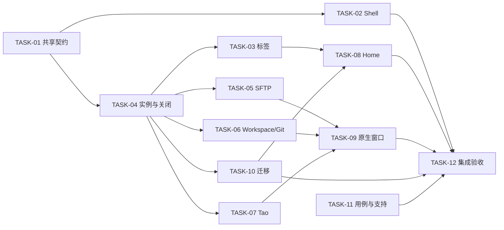

# Taomni 统一工作台壳层与布局易用性重构详细设计

> 状态：实施中 v2；实现及用例随任务板更新，验证结论以实际运行证据为准。
>
> 基线：`5fb098474f072f4e0c7e99407ab0d072b7d49c53`，2026-10-03，Windows；调研开始时工作区干净。
>
> 布局来源：[HTML 初稿 v1](./workspace-shell-ux-redesign-demo.html)。本稿原位细化原设计，保留 AC-01～12、DEC-01～04、V-01～07。
>
> 完整用例：[browser / native 用例设计](./workspace-shell-ux-redesign-test-cases.md#test-cases)。下游必须同时阅读两份 Markdown。
>
> 当前范围：用户已授权按本设计领取全部任务、开发、本地单元测试及 GitHub browser/native 循环验证。Windows、macOS、Linux 均为产品目标端。

## 1. 设计依据、范围与决策

### 1.1 用户目标与交付边界

用户要求“按两份文档的 UI layout 初稿进行详细设计，以便指导其它 agent 开发”，因此沿用初稿的布局方向：统一 Rail / Navigator、按意图组织标签、Context Host 承载业务工具、Tao 聚合 Chat / Notes / Notifications。原稿“只评审原型、不拆任务”的阶段限制由本次请求替代。方向沿用不表示旧原型的每个按钮、尺寸和模拟行为已经验收。

本次实施范围包括：壳层布局、标签总览与快速切换、Home、统一面板宿主、SFTP / Git / Code Workspace 接入、Tao 协调与通知跳转、持久化迁移、关闭保护、受影响原生窗口链路及配套用例。现有协议、业务查询、邮件读写、终端输入和编辑器数据模型继续复用。无需新增 UI 库，使用 React / Zustand / react-resizable-panels / lucide-react 和现有菜单、确认框。

初稿中“3 秒内找到主要动作”是可用性目标；自动化只证明首屏入口可见且可操作，不能据控件挂载速度声称人已在 3 秒内理解。正式可用性测量另记录实际参与者、首次操作耗时和窗口尺寸。

简洁、清晰、易用与未来 AI native 工作空间的共同约束：Rail 保留稳定入口，Navigator 承载所选意图的导航，主工作面承载当前任务，Context Host 承载同一 owner 的工具，Tao 承载对话、Notes 和通知。关闭、移动与跳转都由同一业务实例处理；隐藏面板保留草稿、编辑历史、连接和后台任务。后续 Agent 任务、审阅或结果面板沿现有 surface adapter、关闭风险与目标解析契约接入，不能再增加一套布局状态或关闭确认流程。没有实现的 AI 能力不提前暴露空入口。

### 1.2 原型与详细规格的优先级

原型 v1 保留为布局意图和信息层级参照；实现以本稿及用例中的确定行为为准。以下原型简化不得照搬：

| 初稿差异 / 模拟行为 | v2 实施规则及依据 |
|---|---|
| 文字标题栏 36、Rail 48、Navigator 240、右 Host 320；HTML 为 42 / 52 / 248 / 330 | 使用 HTML 的 42 / 52 / 248 / 330 CSS px，适配双行标签；范围与断点见 §3 |
| HTML 的 Git 在右侧，文字指定底部 | Git 默认底部 280；右侧是用户可选 edge，右侧样式复用原型 |
| Quick Switcher 与 Overview 指向同一弹层 | 复用同一个检索模型；快速切换是紧凑列表，总览是预览卡 |
| 第 7 个标签“自动打开总览”含义不清 | 超过 6 个显示溢出计数；只有显式操作才打开总览，不抢焦点 |
| Tao 打开把 hostOpen 改成 false，关闭未恢复 | 临时抑制同边 Host，保留用户的打开意图，关闭 Tao 恢复当前 owner 的 Host |
| Git / Files / Activity 可以不依 owner 切换 | Host 只显示匹配 owner 的面板；跨 owner 必须先激活目标工作面 |
| 原型按钮只是 toast；系统按钮没有 OS 效果 | 每个入口连接真实 action；不支持的能力隐藏或给明确禁用原因 |
| 原型 Ctrl/Cmd+Tab 与 Ctrl/Cmd+K 未处理冲突 | 遵循 §5 的焦点所有权；macOS 不接管系统 Cmd+Tab |
| 主标签、弹出、固定未完整实现 | 以 §6～9 的能力矩阵、资源与窗口事务为准，不承诺未支持的 tab 脱离 |
| HTML 窄屏隐藏 Navigator，无法从菜单可靠恢复 | 使用可关闭的 Navigator 覆盖层，入口一直可达 |
| HTML 没有状态栏、完整空态、错误态和确认流程 | v2 保留状态栏并补齐；原型截图不作为这些行为已通过的证据 |

### 1.3 决策记录

“沿用用户指定初稿”表示本次方向来源；“agent 自决”表示根据现有代码完成的实现细化，均不伪称用户逐项评审。

| ID | 问题、备选与代价 | 结论 / 理由 | 状态与来源 | AC / TASK / V |
|---|---|---|---|---|
| DEC-01 | 全部放 Tao 会挤压业务内容；独立浮层难恢复；按主工作面 / Host / Hub 分工有清晰 owner | 沿用三类 surface；SFTP/Git 不塞入 Tao，邮件仍是主工作面 | 沿用用户指定初稿，本次请求 | AC-03～06；TASK-04～07；V-03、04 |
| DEC-02 | 平铺难定位；每种类型一组过碎；五个意图组保留跨类型工作流 | Home / Connect / Build / Communicate / Utility；不改变业务类型 | 沿用用户指定初稿 | AC-02、12；TASK-01、03；V-01、02 |
| DEC-03 | 全图标不易理解；所有操作放菜单入口太深 | 宽屏文字，窄屏降级；总览、Tao、面板入口保留 | 沿用用户指定初稿 | AC-07、08；TASK-02；V-06 |
| DEC-04 | 欢迎页易失去入口；自动启动最近连接会触发认证与后台工作 | 固定 Home 双入口；三主动作、最近项、显式恢复 | 沿用用户指定初稿 | AC-01、10；TASK-08；V-05 |
| DEC-05 | React 分支重挂载实现简单，但会丢编辑历史、PTY 和传输视图；稳定实例宿主有接入成本 | 使用稳定 surface 容器与业务 adapter；隐藏只改变布局及焦点资格 | agent 自决；MainLayout、SFTP refcount、编辑器实例证据 | AC-03～05、13；TASK-04～06；V-03、07 |
| DEC-06 | 强占 Ctrl+K / Cmd+Tab 会破坏终端与 OS；随意换键又可能占用邮件和 IDEA keymap | 默认组合只在未被当前 surface 声明占用时执行；提供可点击入口与可重绑定 action | agent 自决；TerminalPanel、shellShortcutRouter | AC-11、16；TASK-03；V-02、06、07 |
| DEC-07 | 原型与文字像素不同；另做视觉体系成本无依据 | 采用 HTML 尺寸、生产 theme token；Git 默认底部；保留原主题和语言能力 | agent 自决；来源差异见 §1.2 | AC-07、08；TASK-02；V-06 |
| DEC-08 | 把现有 SFTP 弹出当成同一物理连接会产生错误生命周期假设 | 保留独立弹窗连接，统一逻辑面板身份；原传输继续在原通道，窗口回停靠按事务执行 | agent 自决；openDetachedSftp 现有独立 sessionId | AC-03、09、18；TASK-05、09；V-03、07 |
| DEC-09 | 完整 Hub 主标签 / Hub 原生弹窗并非原型已展示的主流程，也无现成 TabKind/窗口支持 | 本批交付 Hub 停靠/覆盖层与 Notes 现有弹出；初稿的“如果在标签打开 Tao”保留为扩展点，不显示空入口。Git 弹出纳入本批 | agent 自决；按已有能力与原型范围收敛 | AC-05、18；TASK-07、09；V-04、07 |
| DEC-10 | 仅修改视觉会绕过根标签 dirty、事务和传输检查；原代码不是统一的关闭事务 | 所有用户关闭入口先经过统一 close coordinator，业务 adapter 提供风险与提交 | agent 自决；removeTab/removeTabs 及退出路径 | AC-09、17；TASK-04、10；V-03、07 |
| DEC-11 | 六端自动化不能完整证明真实 OS 对话框、部分 OS 输入与物理设备/性能边界 | 本轮 done 以实现完成和最终输入六端自动化全部通过为准；其余明确边界单列后续验收，保留完整规格与未验证状态 | 用户 2026-10-05 明确确认“单列后续验收；本轮以实现和六端自动化通过为 done 条件” | TASK-01～12；§14 与用例当前结果 |
| DEC-12 | LAN 分支与其它保留行为共用部分 Shell 用例 | 本轮排除 LAN Chat 自动化；移除共享用例中的 LAN 分支，保留其它行为的结果与预算。N20 保留规格和历史证据，本轮不选择 | 用户 2026-10-06 明确要求“LAN Chat相关功能不用测试” | TASK-11、12；290 ID / 875 次六端范围 |

没有需要新增用户选择才能继续设计的实质分歧。各任务可按 §12 依赖开展；原型和文档的实施细节仍可在后续产品反馈中按稳定 ID 修订。

## 2. 当前代码事实与调用链

### 2.1 复用点与必须补足的能力

以下均为静态源码调研；未执行产品基线。行号为基线定位提示，下游以符号为准。

| 路径 / 符号 | 当前事实 | 设计影响 |
|---|---|---|
| `src/types/index.ts:9` TabKind、:425 Tab | 21 个类型；Tab 有 chatTabId、sessionId、workspaceInstanceId 等身份 | 展示类型单列，不向 Tab 写重复的业务状态 |
| `src/stores/appStore.ts:951` addTab / :1194 setActiveTab | 新标签清 tabFilter；duplicate workspace 创建新 instance；tabs 与 activeTabId 是权威 | lane/MRU/总览订阅事实，不再保存第二套活动业务 tab |
| `src/stores/appStore.ts:1049` removeTab / removeTabs | 根标签删除直接更新数组；SQL flush 为异步调用，不构成关闭成功的等待契约 | 不能写成“已复用完整统一确认”；TASK-04 新建 coordinator，等待业务检查与 flush |
| `src/layouts/MainLayout.tsx:733` MainLayout | 多类业务面板按 tab 挂载；另有 terminal split、workspace action、SFTP 与 Tao 布局 | 先提取壳层职责，保持业务组件稳定 key 和原连接 owner |
| MainLayout :1017 terminal closed effect、:1200 openDetachedSftp | 关闭 terminal 清 attached 和 detached SFTP 引用；弹窗通道独立 | 主标签关闭需与 panel lease 协调，防重复 detach / 提前回收 |
| `src/stores/sftpStore.ts:437` detach；`src-tauri/src/filebrowser/mod.rs:118` sftp_detach | frontend refcount；最后引用释放时删 backend session；Rust 移除 registry | 引入明确 view/job lease；不能把“有传输”当作已经有可靠跨窗口 owner |
| `src/components/git/WorkspaceGitManager.tsx`、MainLayout workspace Git handlers | Code Workspace 已有 roots / instance 关联、Git manager 和同步规则 | 复用 manager，禁止另开第二个状态不一致的 Git controller |
| `src/stores/sidebarRailPolicy.ts` | code-workspace / terminal / other 各自折叠偏好；mergeToolWindowRail 默认开启 | 旧组到 lane 迁移需要明确优先级，保留旧 key 供回退 |
| `src/components/tabbar/TabBar.tsx:437` | close、close others/all、rename、duplicate、move、copy info | 所有入口迁移，不能只更新顶部关闭按钮 |
| `src/components/terminal/TerminalPanel.tsx:1872` | Ctrl+K 为 AI 命令改写，Ctrl+Shift+P 为本地命令面板 | 终端按键优先，Shell 快捷键不是无条件全局 capture |
| `src/components/editor/workspace/shellShortcutRouter.ts`、`src/lib/shellKeyClaims.ts` | modal > workspace > active tab > shell；现有 Cmd+数字避让编辑器 | 扩展统一 routing，不叠加互相竞争的 window listener |
| `src/components/WelcomePanel.tsx:114`、`src/hooks/useWelcomeSessionResume.ts` | shell 启动返回 started/failed/cancelled；恢复有 ready/partial/failed、重试、取消 | 只重排 UI；Tab 出现不能视为 PTY ready 或 restore 成功 |
| `src/types/index.ts:525` SnapshotEntry、RecentWorkspace | 运行快照仅 saved-session / local-terminal；RecentWorkspace 按 roots/looseFiles 记录最近项目，不是同路径多实例恢复清单 | workspace 恢复描述是本批新增 Shell 数据，不能假称现有 run snapshot 已能恢复 W1/W2 |
| `src/components/database/DbClientTab.tsx:693` 连接 effect cleanup | unmount 时对 pending manual transaction 做异步 rollback，再 disconnect | 新关闭保护必须接到 unmount 之前；coordinator 已 commit/rollback 后 cleanup 不可重复处理旧 pending 状态 |
| `src/components/chat/ChatDrawer.tsx`、`src/stores/chatStore.ts` | Hub 已有三个 tab，4 edge / pin / opacity；位置在 chatDrawer.layout.v1 | 迁移布局的单写者，保留老入口兼容 action |
| `src/stores/taoHubStore.ts` | lastTab.v1 只恢复 chat/notes，notifications 不写入 | 延续“不会启动就打开通知”的偏好语义 |
| `src/lib/tao/taoAlerts.ts`、taoAlertStore | source 仅 chat/notes/mail；历史 30/300；fireAt 单位秒 | transfer 是本批新增 source，需排序、去重、历史与跳转类型适配 |
| `src/lib/detachedSession.ts`、`src-tauri/src/windowing/mod.rs` | TTL handoff、reattach 同步；窗口白名单无 git / code-workspace / hub | Git 需要显式增加路由及权限；不宣称所有业务类型已有脱离 |
| `src-tauri/tauri.conf.json` | 主窗口默认 1280×800，最小 800×600；native devUrl 1980 | 小于 720 CSS px 用 browser/缩放验证；不为测试偷偷减小 native 最小尺寸 |
| `qa-ui-auto-tests/cases/TC-043-…yaml`、TC-100 | 前者只点弹出且观察按钮；后者窗口按钮仅检查存在 | 不能用旧用例证明 OS 窗口已打开、移动或关闭，需新增 native 结果断言 |

### 2.2 保留调用关系

`Home / Rail / 菜单 / 总览 / 快捷键 → Shell action dispatcher → 既有 handleCommand / session opener / workspace action / panel adapter → 业务 store / IPC → 可见结果`。

`通知点击 → resolve target → 激活 owner → 等待目标 ready → reveal → 确认该提醒`。中途失败保留待处理状态。

`关闭入口 → close coordinator → 查询风险 → 用户选择 → await 保存/事务/传输交接 → commit remove → 释放 owner lease`。业务的低层 remove 不能直接暴露给新 UI action。

## 3. UI Layout 规格

### 3.1 区域与尺寸

所有尺寸是 CSS px；原生逻辑坐标、物理截图像素和 DPI 必须分别记录。以下是默认值及边界，不把原型颜色硬编码到生产。

| 区域 | 默认 / 范围 | 布局、溢出、职责 |
|---|---|---|
| 标题栏 | 默认高 42；W<560 时两行共 84；按钮命中区至少 32×32，图标 16 | app menu、Navigator toggle、Quick Switch、lane、tab strip、面板、Tao、所有标签、更多、系统区；Windows/Linux 系统按钮保留每个宽 40 |
| 窗口抓手 | 右上角标题栏系统区的独立 WindowDragHandle | 按最新用户决定移至右上角，删除左上角 Navigator 展开按钮；原生拖动与窗口缩放互不干扰 |
| Rail | 图标模式宽 52，命中区 40×40；显示名称时宽至少 68、按钮高 48，名称位于图标下方；上下间距 4 | Home / Sessions / Workspaces / Tao，底部 Settings；沿用原名称/宽度偏好，英文主入口完整可读，窄屏也不消失 |
| Navigator | 默认 248，最小 200，最大 min(400, W×0.32) | 独立纵向滚动，标题固定；折叠不占宽度；splitter 6 |
| 主工作面 | flex 1，min-width/min-height:0；普通停靠时尽量保留 480×240 | 业务自己处理内部溢出；Shell 不给整个页面加横向滚动 |
| surface toolbar | 内容需要时 36；业务无动作时不额外占行 | 标题、owner 信息、上下文入口；不能复制已有业务标题栏 |
| 右 Context Host | 默认 330，最小 280，最大 min(W×0.42, 600) | header 40，tabs 32；内容独立滚动 |
| 底 Context Host | 默认 280，最小 220，最大 bodyH×0.45 | 仅占中央工作面下方，不能覆盖 Rail / Navigator / 状态栏 |
| Tao | 默认右侧 360；宽度 300～min(W×0.42,600) | header 40，tabs 32；侧停靠与覆盖层共用内容实例 |
| 状态栏 | 高 22 | 保留连接数、任务、状态、editor status slot；低优先信息缩略，错误可展开 |
| Overview | max-width 980；四边至少 16；max-height bodyH−32 | 固定搜索/筛选头，卡片区滚动；卡片最小宽 280，高度按内容但摘要最多 2 行 |
| Quick Switcher | max-width 640；max-height bodyH×0.72 | 搜索固定，结果纵向列表，选中项自动滚入可见范围 |

颜色使用 `--taomni-*` 现有 token；新增仅允许 `--shell-rail-width` 等布局变量。圆角、菜单、阴影、焦点环沿用应用。主题切换即时生效；原型渐变 T 标志不作为新品牌要求。

### 3.2 尺寸求解与断点

令 W/H 为 WebView CSS viewport，bodyH = H−标题栏−可见 QuickConnect 高度−状态栏。先预留系统按钮，再按下面顺序计算；不能只写固定 media query 导致多面板相加挤没主工作面。

1. W≥1200：Navigator 按偏好；当前 owner 的左右/底部 Host 可见；一个 edge 只一个宿主。主工作面宽低于 480 时临时折叠 Navigator，再把最后打开的侧 Host 改为覆盖层。
2. 960≤W<1200：Navigator 默认临时折叠，用户仍可展开；不足 480 时 Navigator 作为覆盖层。次要文字和标签副标题先隐藏；不改持久化偏好。
3. 720≤W<960：Navigator、侧/底 Host、Tao 使用 body 区域内的覆盖层；同一时刻一个主覆盖层。面板 header/关闭始终可见，背景 inert；Rail 和系统按钮仍可达。
4. 560≤W<720：标题条仅固定 Home、当前标签摘要、Quick Switch 图标、面板、Tao、带文案“所有标签”、更多及系统区；当前标题可缩至省略号但提供完整 aria-label。导航按钮可并入 Rail，动作不可全藏进更多。W<560 时为两行：第一行 app menu / Home / 当前摘要 / 系统区，第二行 Quick Switch / 面板 / Tao / 所有标签 / 更多；每行 42，bodyH 使用实际标题高度。这样 800 逻辑宽在 200% 缩放后的约 400 CSS px 仍可操作。
5. 低高度：无法同时满足主工作面 240 和底 Host 220 时底 Host 改覆盖层；Home 的三主动作优先，恢复和最近项允许滚动。
6. 从窄屏回宽屏：恢复用户偏好尺寸和 docked 状态，不把临时 clamp/overlay 写回 storage；用户拖动结束才保存新值。pointercancel/Esc 放弃本次拖动。
7. 100% / 125% / 150% / 200% 缩放使用实际 CSS viewport 求解。最小原生窗口不变；例如 800 逻辑宽在放大后可能进入 CSS 紧凑区间。

覆盖层宽度取 min(用户偏好宽度, 可用工作区宽度−16)，极窄时允许低于停靠最小宽度 280；单列总览卡片 min-width:0。停靠最小值不适用于覆盖层，不能为保 280 强行盖住 Rail 或把关闭按钮挤出视口。小于 560 的两行降级是 v2 对初稿极窄/缩放场景的补充。

默认 1440×900 截面：

```text
┌ 标题栏 42：菜单 导航 快切 lane [Home][当前 lane 标签…] 面板 Tao 所有标签 更多 窗口 ┐
│拖│Rail52│ Navigator248 │ 主工作面（业务 toolbar + 内容） │ Right Host330 / Tao360 │
│拽│      │              │                                │                       │
│带│      │              ├ Bottom Host280（Git 等）───────┤                       │
└────────────────────────────── 状态栏 22 ──────────────────────────────────────┘
```

Git 与右 Tao 可同时停靠；右 Files 与右 Tao 互斥。Tao 选在底部时同样抑制底 Host；左侧抑制 Navigator，顶部位于标题栏之下。主工作面最小可读空间规则对所有 edge 生效。

### 3.3 Rail / Navigator

- Home 按钮激活唯一 `welcome`，同顶部 Home tab；不可关闭、复制或移动 lane。新开应用无工作集恢复时进入 Home。
- Sessions 只选中/展开保存会话 Navigator，不切换当前主标签；再次点击收起，树选中、搜索、展开状态保留。新建/编辑/删除/拖动分组继续使用原 SessionTree。
- Workspaces 显示最近工作区；当前 Code Workspace 可在同一 Navigator 的“项目”页显示原项目树实例。打开项目是业务操作，选择 Rail 不是再次创建工作区。
- Mail 的账户/文件夹仍属 Mail 内部；DB 对象树仍属数据库内部。不得因为已有 Navigator 再渲染第二份相同业务树。
- Tao 是全局 toggle，不把 Navigator 的 selected area 改为 tao。关闭后 Sessions/Workspaces 原选择保留。Settings 激活唯一 settings 主标签（Utility）。
- `mergeToolWindowRail=true`：现有工作区/终端 tool-window 按钮放在 Rail 的上下文段，与常驻区分隔，原内部 stripe 不重复；关闭该设置时保留内部 stripe。Project 只允许一个可交互实例。
- 原 Tools 内容放入 Workspaces 的“工具”页及应用“工具”菜单，原服务器/隧道/SocksCap/MFA/网络工具入口逐项可达；永久删除 Tools 按钮不等于删除这些能力。
- 名称显示偏好继续有效：52 是图标模式默认；启用已有名称显示时 Rail 可扩展到现有 stripe 的偏好宽度，并重新走空间求解。不能迁移后强制抹除该偏好。

## 4. 标签、总览与快速切换

### 4.1 全量类型与身份

| 默认 lane | TabKind |
|---|---|
| home | welcome |
| connect | terminal、sftp、rdp、vnc、file-browser、object-storage |
| build | code-workspace、git、database、redis、hbase-shell |
| communicate | mail、mail-unified、lan-chat |
| utility | nettools、sockscap、proxy-test、mfa、settings、placeholder；未知类型 |

映射函数接受未知字符串并给 Utility fallback；不能 cast 后遗漏分支。未知业务 render 仍用 UnavailablePanel，并允许查看详情/关闭。lane 的分类不改变协议能力；手工“移至分组”仅写展示 override，Home 除外。

身份必须分开：`tabId` 当前 UI 实例；`chatTabId` 对话绑定；`workspaceInstanceId` 工作区实例；`sessionId` 保存连接；`backendSessionId` 真实连接；`panelId` 逻辑工具实例。重复打开/复制不允许只按标题或路径合并不同 workspace 实例。

拟新增的纯展示输出固定如下，调用方不得从颜色或标题反推业务能力：

```ts
interface TabPresentation {
  tabId: string;
  defaultLane: TabLane;
  lane: TabLane;
  role: "primary"; // Context Host/Hub use their own instance descriptor, not fake tabs.
  active: boolean;
  pinned: boolean;
  dirty: boolean;
  attention: "none" | "unread" | "busy" | "error";
  unreadCount: number;
  lastUsedAt: number; // milliseconds; only committed activation updates this
  preview: {
    kind: "terminal" | "tree" | "mail" | "database" | "remote" | "tool";
    summary: string;
    secondary?: string;
  };
  capabilities: { close: boolean; duplicate: boolean; detach: boolean; rename: boolean };
}
```

attention 优先 error > busy > unread > none，dirty 和 active 单独表达；有错误同时有未读时保留实际 unreadCount 和 aria 摘要。断线是连接状态文本，无错误详情时不伪造 error。MRU 用提交激活的递增序号保证同毫秒/系统时钟回拨下顺序稳定；lastUsedAt 仅用于展示。preview 从业务已提供的快照/registry 派生，隐藏时不订阅高频全 buffer；更新合并，不加生产轮询。未提供的字段用明确摘要兜底。

### 4.2 标签条

- 固定 Home + 当前 lane 的标签；可用宽度内优先显示活动项及邻项，最多 6 个业务项，其余进入总览。也可通过条内滚动查看当前 lane 全集；计数是全窗口主标签数（含 Home），不含 Context Panel。
- 点击 lane：激活该 lane 最近使用且仍存活的主标签；空 lane 展示空工作面及对应“新建连接/打开工作区/打开邮件/工具”动作，不捏造业务 tab。activeTabId 保持最后真实 tab，Shell 的 `laneSelection` 显式标识空组浏览。
- 空组浏览时有效主工作面是空态，原 activeTab 对应业务视图仅保活且 inert；上下文 Action/键位不继续暴露原 tab 能力。用户点返回/选择存活 tab 后才恢复该业务焦点。能力解析必须使用有效工作面，不能只读 activeTabId。
- 激活真实 tab 时原子清除空组浏览并同步 lane；浏览总览筛选不改变 activeTabId。后台新输出只更新 attention，不激活 tab。
- 连接 ready、工作区模型晚绑定及 restoreRef 补齐只更新元数据。即使对应 tab 仍是 activeTabId，也不能清除用户已选择的空组、重复提交激活或重排 MRU；lastActiveRestoreRef 的补记与实际导航分开。B07 的持久化就绪后 Lane/inert/Home 检查和 ShellFrame 挂载回归保护这一边界。
- 当活动 tab 被关闭：优先同 lane 最近使用的存活项，其次全局 MRU，再 Home。非活动 tab 关闭不改变活动项。
- 保留 rename（Enter 提交 / Esc 放弃）、manual terminal title、duplicate 的 cwd/profile、拖拽顺序、前后/首尾移动、连接信息复制、详情与中键关闭。Home 不可被移动越过；被折叠项在总览仍可定位。
- 固定 tab 在本 lane 的普通项之前；隐藏关闭图标，右键“取消固定”可恢复。显式关闭固定项仍走保护；批量关闭默认排除固定项，并显示将关闭数量；Home 永远排除。
- “移动 lane”只允许 Connect/Build/Communicate/Utility；恢复默认分组清 override。跨 lane drag 需有明确 drop target；Esc 放弃不改顺序。
- `appStore.tabFilter` 保留 query/group/multi 的既有表达；新 UI 显示可清除 chip。显式打开/复制标签清临时过滤，既有 filter 不得让新标签不可达。修改 source store 的过滤语义需与总览适配一并交付。

### 4.3 Tab Overview

入口为标题栏“所有标签”、应用“视图 → 所有标签”、Shell action。打开时默认“全部”、空 query、“最近使用”；将焦点放搜索框，当前项滚入视野。关闭可用关闭按钮、Esc、空白遮罩；不改变原 active tab，恢复到 opener（已不存在则活动 tab，再主工作面）。

- 检索字段：标题、类型名称（中英别名）、主机、显示路径、保存分组、邮箱账户、workspace 名；trim、Unicode NFC、大小写不敏感，空格分词 AND。不搜索密码、连接 URL 中凭据、正文全文。
- 筛选：lane、仅有提醒、旧 group/multi；互为 AND。排序：MRU 默认、类型、名称；同值按原 tab 顺序，tabId 最终兜底。列表打开期间 MRU 快照固定，避免指针/焦点跳动；业务标题/attention 可以刷新。
- 过滤排除当前 tab 时显示“当前标签不在结果中 · 定位当前”按钮；点击清相关筛选并定位，不额外插入不匹配卡片。空结果提供“清除筛选”“回 Home”“新建连接”真实动作。
- 卡片：图标+标题+类型+host/path+状态文本+最多两行语义预览。连接中显示 loading；错误有可读摘要；断线可跳回原 tab 重试。preview 无数据显示“暂无预览”，不启动连接或执行查询来生成预览。
- Terminal 最近输出摘要只使用已有可用的限长文本、去控制字符且不持久化；拿不到安全摘要就展示 shell/host/cwd。Code 显示文件/分支，Mail 显示现有账户/选中主题的限长摘要，DB 显示引擎/查询名，remote 显示分辨率/连接态；不抓屏、不后台截取全部内容。
- 卡片主体与 close/pin/menu 为兄弟控件，禁止 button 嵌套；关闭按钮只关闭该卡片，不同时激活。Delete 仅在卡片焦点且不处于编辑态时调用同一 close coordinator。
- 2/3 列：容器内容宽足够容纳 3×280+2×12 时为 3 列，否则 2 列，低于 2×280+12 为 1 列。方向键按实际列数移动；Home/End 首尾；Enter 激活并关闭；删除后焦点落下一项、否则上一项、否则搜索框。
- 0 / 1 / 6 / 7 / 30 / 100 标签均有边界用例；若采用虚拟化，不得破坏 active descendant、全量计数、搜索结果和键盘跨 viewport。

### 4.4 Quick Switcher

与 Overview 共用 tabPresentation / search / attention；使用 combobox + listbox + option，只有单选切换，不在行内提供 destructive action。默认 MRU（当前项放首项但下一次方向键到前一个 tab）；输入后按匹配排序；Enter 激活一次，Esc 取消。快速切换与总览互斥，切到总览时可携带 query，不能叠两个 focus trap。无结果动作同总览。

## 5. Actions、键盘、焦点与层级

### 5.1 入口契约

拟新增 `src/lib/shell/shellActions.ts`，action ID 不使用翻译文案。Toolbar、Rail、菜单与快捷键调用同一 dispatcher；菜单打开时捕获 target tabId，执行前检查 target 仍存在，不能把迟到动作执行到另一个活动 tab。

| action ID | 可见入口 | 参数 / 结果 |
|---|---|---|
| shell.home | Rail / 固定 Home / 空态 | 激活 welcome，关闭导航类覆盖层 |
| shell.quickSwitch / shell.overview | 顶部 / 视图菜单 / 快捷键 | variant、query；互斥弹层 |
| shell.selectLane / shell.moveTabToLane | lane selector / tab menu | lane；后者明确 tabId |
| shell.navigator.toggle | 导航按钮 / Sessions、Workspaces / 视图菜单 | area；切换展示，不新建业务 |
| shell.panel.open / hide / pin / move / promote / detach / reattach / close | 上下文工具栏 / Host header / Host menu / 对应 workspace action | panelId 或 kind+owner；capability 检查一致 |
| shell.tao.toggle / shell.tao.select | Rail / 标题栏 / Notes 与通知入口 | hub tab；只选一个真实 Hub |
| shell.tab.close / closeOthers / closeAll / rename / duplicate / pin / move | tab close / 中键 / 右键 / Overview / 应用菜单 | 显式目标集合；统一 close coordinator |
| shell.layout.reset | 视图 → 重置布局 | 确认后只清壳层偏好，业务数据和工作集保持 |

现有 `new-terminal/new-session/new-sftp/code-workspace/git/settings/close-active/exit` AppCommand ID 保留；转发适配器连接新 dispatcher。现有 `TabActionSlot` 保留，SFTP / Git / remote action 仍按 active tab 提供，不能混入其他 owner 的操作。

### 5.2 快捷键与优先级

复用现有 routing，优先级：modal / composition → focused workspace → focused business surface → shell。claimed-but-disabled 也不能穿透到 Shell 执行同键不同操作。只在确实分发或阻止时 preventDefault。

| 键 | 目标行为 / 避让 |
|---|---|
| Ctrl+K（Win/Linux）、Cmd+K（macOS） | 快速切换的 Shell 默认；终端 Ctrl+K、编辑器 chord、可编辑输入的既有功能优先；需要无冲突绑定时用户通过 Shell keymap 设置改绑 |
| Control+Tab / Control+Shift+Tab（三端） | Shell 焦点下按 MRU 前后；workspace 内原 editor switcher 优先；macOS Cmd+Tab 始终留给 OS |
| Ctrl/Cmd+Shift+H | 保留现有标签详情入口，可从总览打开同一详情；不是另一个总览 listener |
| Ctrl/Cmd+Shift+T | 保留 workspace reopen 与 Shell new-terminal 现有优先级，不因为新增 Shell 监听破坏 |
| Cmd+1…9（macOS） | 延续 shellKeyClaimed 的工作区避让；Shell 上使用可见主标签顺序，9 对应最后一项，Home 算第一项 |
| Esc | composition 交给 IME；否则先关最顶层菜单/对话框/总览，再关临时覆盖层；已停靠 Host 只将焦点送回工作面，不清内容 |
| Tab / Shift+Tab | modal 内循环；停靠面板内按 DOM 顺序，可离开；后台隐藏面板 inert，不进入焦点序列 |

MRU 连续按住 Control 时冻结候选序列，方向切换不即时重排；释放后提交最终项并更新 MRU；Esc 回到原 tab。浏览器无法证明被浏览器/OS 抢占的组合，native 用例单独验证。

拟新增 Shell keymap 的持久化 key `taomni.shellKeymap.v1`，action ID + 规范化 modifiers；重绑定冲突列出作用域并可取消。与 workspace keymap 分域，不能覆写其配置或把 Cmd 字符串存成 action。配套设置入口位于现有 Settings 的快捷键区域，由 TASK-03 接入。

### 5.3 浮层与可访问性

壳层根节点建立局部 stacking context：内容 0、停靠 10、覆盖 Host/Navigator/Tao 20、菜单 30、Quick/Overview 40、确认/原生前置 modal 50、toast 60；复用现有全局 modal 层时按上述相对关系适配，不在任意子组件堆高 z-index。

Rail 是 navigation；tab strip 为 tablist；tab 为 tab；业务 region 有 aria-labelledby；active/attention/error 不只靠颜色。splitter 为 separator，带 orientation、valuemin/max/now；方向键每次 8 px，Shift 每次 32，Home/End 到边界。resize announce 只在结束或键盘步进时发出，避免拖动刷屏。

打开 panel 聚焦其标题/首个功能控件；隐藏后回到对应入口或 owner 主工作面。异步加载完成不夺走用户后来移到其他控件的焦点。切换 owner 时，旧 panel 的异步回复不能改变新 owner 的选中、焦点或状态。所有文案进入 zh-CN/en locale；系统深色、高对比与 reduced-motion 沿用现有主题。


## 6. Context Host 与业务接入

### 6.1 状态模型

初稿把 hidden/docked/detached/closed 当一组状态，不足以表达“仍在加载但暂时被 Tao 挡住”。实施必须分离生命周期、位置和可见性：

```ts
type TabLane = "home" | "connect" | "build" | "communicate" | "utility";
type PanelKind = "sftp" | "git" | "problems" | "workspace-terminal";
type DockEdge = "left" | "right" | "top" | "bottom";
type PanelOwner =
  | { kind: "tab"; tabId: string; restoreRef?: string }
  | { kind: "workspace"; tabId: string; workspaceInstanceId: string; restoreRef?: string }
  | { kind: "background"; resourceKey: string; restoreRef?: string };
type PanelPlacement = { kind: "dock"; edge: "right" | "bottom" }
  | { kind: "primary"; tabId: string }
  | { kind: "detached"; windowLabel: string };
interface PanelInstance {
  id: string;                     // logical identity, not backend session id
  kind: PanelKind;
  owner: PanelOwner;
  generation: number;              // increments for owner/repository replacement
  phase: "initializing" | "ready" | "failed" | "closing";
  requestedOpen: boolean;
  pinned: boolean;                 // prefer docked; never lock to another owner
  placement: PanelPlacement;
  operation: null | { id: string; type: "promote" | "detach" | "reattach" | "close" };
  error: null | { code: string; message: string; retryable: boolean };
}
```

有效可见性派生为 `visible / hidden / suppressed-by-tao / inactive-owner / detached-placeholder`；不存在的实例即 closed。restoring 是恢复操作的 phase，不伪装成已连接。Host 同一 edge 有一个 tab strip，可含多个当前 owner 面板；面板内部 Files/Transfers、Changes/History/Branches 是业务子 tab，不能与 Host tab 混用。

同一 owner 已创建且暂时隐藏的工具保留在 Host 标签中，点击标签恢复原实例；全部面板隐藏时收起该边的宿主。切换 owner 时只展示目标 owner 的标签。覆盖层跨边移动后，焦点与外部点击监听必须跟随当前宿主。

实例查找键：SFTP 为 owner tabId + kind；Git 为 workspaceInstanceId + kind；Problems/Terminal 同 workspaceInstanceId。显式“新窗口/复制工作区”才产生新身份；同一目录的两个 workspace 实例不能合并。

background.resourceKey 是逻辑面板的任务组身份，多个 job lease 可共同持有；jobId→resourceKey 由业务任务 registry 管理。不能只用某一个 jobId 作为面板 owner，导致同一面板第一个任务结束就释放其余任务。

### 6.2 生命周期与空间仲裁

| 当前 / 事件 | 必须执行 | 可见结果与失败处理 |
|---|---|---|
| closed → open | 创建一次 adapter + stable container，登记 owner | initializing；重复 open 共用同一次 promise |
| ready hidden → open | requestedOpen=true，激活对应 Host tab | 复原路径、scroll、选择、草稿；无重连 |
| docked → hide / header X | requestedOpen=false，仅隐藏 | 不确认、不释放传输/订阅；X tooltip 为“隐藏面板” |
| docked → pin/unpin | 只改变 dock preference | pinned 尽量内联，unpin 覆盖；空间不足可临时覆盖但不改偏好 |
| owner A → B | A 隐藏，按 B 的记录显示 | A 状态保留；若 B 无面板，Host 不展示 A 数据 |
| Tao 打开同 edge | 抑制 Host；不改 requestedOpen/pin/size | 关闭 Tao 按当前 owner 恢复；不恢复已关闭 A 的面板 |
| Tao 打开时显式 open panel | 关闭/隐藏 Tao，打开目标 panel | 用户最新显式选择优先；不会递归 reopen Tao |
| right ↔ bottom / overlay ↔ dock | 移动稳定容器，保留 adapter | view snapshot / selection / scroll 不丢；只在非零尺寸后通知 resize |
| failed → retry | 新 operationId；清旧 error；generation 守卫 | 成功只更新原 panel；切走后的迟到结果不污染当前 owner |
| more → close | 经过 close coordinator，之后释放 view lease | dirty/job 有选项；失败保持实例和重试入口 |
| owner 已关闭且 job 活动 | 交接为 background 任务组 owner | 最近面板/传输通知可重新打开；owner 名保留为显示摘要 |
| owner 已关闭且无 job | 保存非敏感恢复描述后释放 | 最近面板只保留 metadata；重新打开需要重新绑定 owner/认证 |

“最近面板”在 Context menu 的独立列表，最多 20 个，按使用时间排序；不计入主 tab 数，也不保证原连接仍存活。缺失 owner 显示“重新打开连接/工作区”，已删配置显示“选择连接”，不得默默绑定标题相同的 tab。

### 6.3 稳定挂载

拟新增 `ShellSurfaceRegistry` 与 `SurfaceSlot`。一个业务 surface 对应一个稳定 React key、一个 DOM 容器、一个 adapter。宿主只移动容器到目的 slot；portal 的 target 本身保持不变。隐藏使用 display/inert/aria-hidden，不把整个组件从 React tree 删除再重建。禁止复制 FileBrowser/CodeMirror/TerminalPanel 来“保持状态”。

主工作面按原 tab identity 挂载；lane 过滤只影响导航，可见性不决定连接生命周期。切 lane 不能重新执行 connect。图表/终端/editor 的 fit/measure 由可见性与最终尺寸触发；不在 0×0 隐藏状态发送远端 resize。DOM 移动前记录可恢复焦点，之后仅在原焦点仍属该 surface 时恢复。

SSH 启动必须在真实空闲 prompt 后完成隐藏初始化，再提供 ready 状态；判断近期输出时先排除 xterm 预分配的尾部空白行。Git Bash 使用现有单次 cwd probe，避免在 ConPTY 中注入过长的 prompt hook。终端高度、Settings/Host 切换不能使初始化命令可见或破坏随后用户输入。

Code Workspace 项目树迁移到 Navigator 时保留模型、展开、选中、rename 和拖拽控制器；该树只存在一个视图实例。内部 tool windows 通过 adapter 接入 Host。现有 Project/Problems/Terminal 快捷键和 Shift+F12 仍调用原工作区 action，再由 adapter 改 Host 可见性；不创建第二套“Problems 已打开”布尔值。

### 6.4 SFTP

- 从 SSH/支持附属文件的 terminal 进入默认右 Host，业务 tab 为 Files / Transfers；Files 继续保留 local/remote 双窗格、切方向、隐藏文件、路径补全、排序、多选、队列、权限编辑和“在这里打开终端”。
- 支持能力来自原 terminal 的协议判断；LocalShell 不假装拥有 SSH SFTP。若提供本地文件浏览，使用既有 LocalFileBrowser，文案与能力不同。
- cwd 只在用户按现有“同步”时查询；不能因 owner 切换或 Host 迁移自动 cd 远端。
- attach 保留 in-flight 去重与 refcount；定义 `view lease` 与 `job lease`。一个队列任务注册到完成/失败/取消终态前持有 job lease；隐藏/提升主标签不释放。TASK-05 须核对 FileBrowser 的 attach cleanup 与 MainLayout 的 closed effect，消除重复释放。
- 关闭 owner 时可“继续后台传输并关闭”“取消传输并关闭”“取消关闭”。第一项等待 lease 交接成功再删除 owner，传输状态入口留在 Tao/状态栏；第二项等待任务终态再释放。应用退出无“继续后台”选项，因为进程终止后任务不能继续。
- 提升到主标签复用当前 surface，不创建第二条 SFTP 通道；新顶部 SFTP tab 引用 panelId，关闭后可回停靠或关闭实例。原 owner 关闭但已提升的 SFTP tab 仍为 view owner；不用旧 closed effect 清它。
- **原生弹出保留独立连接**：沿用 `attached-…__detached` 的独立 browser 通道，原通道中的 transfer 不迁移。两者属于同一 logicalPanel，队列明确显示任务所在实例；只有一个可见文件视图。弹窗 ready 前原视图继续可操作；失败恢复原布局。
- 传输在弹窗中启动后，弹窗关闭/回停靠须等待任务结束，或明确取消后关闭；若实现 job view 在主进程长期持有，可交接后回停靠，但不得靠窗口销毁赌任务继续。当前批默认“有任务时隐藏窗口、任务完成后释放”，主窗口留任务入口；退出统一处理。
- view refcount 是每个 WebView 的内存状态，不能直接当跨窗口 refcount。窗口内 job owner 保持存活直到后端任务终态，主窗口通过已验证的 jobId/resourceKey 消息显示状态；执行 cancel/pause/resume 仍使用现有后端命令。源窗口确实必须销毁时，只有 TASK-05 验证后端持有的 transfer handle 与订阅接管后才可交接；否则走等待或取消，不能删除最后一个实际 owner。

### 6.5 Git / Code Workspace / 其他消费者

- Git 默认底 Host；先复用 WorkspaceGitManager 的 roots 与工作区同步，Changes/History/Branches 的能力取原业务实现。无 repo 显示“初始化仓库”“选择目录”，失败保留原因/重试。初始化属于显式业务动作，不因打开 Host 自动 git init。
- Git pane owner 使用 workspaceInstanceId；切换 roots 增 generation；A 的旧 diff/status 响应不得写到 B。返回 A 保留选中变更、diff 滚动和提交输入。
- 独立打开 Git（Home/菜单/外部路径）仍创建主 Git tab；从 Workspace Git action 进入 Host，二者按逻辑身份区分。promote 只移动同一 Git controller，不另建副本。
- Problems / 工作区 Terminal 的默认底边、项目树默认左边保持。同边面板互斥可见但后台任务继续；Show All/Hide All 恢复自己的集合，不影响全局 Tao。
- Mail、DB、Redis、HBase、RDP/VNC、object storage、LAN Chat 继续作为主工作面。仅接入 presentation / action / close adapter，不重写内部多栏布局。
- primary detach capability 只对原来已支持的 terminal/SFTP/database/RDP/VNC 及本批新增 Git 开启；Notes 沿用其独立路线。Code Workspace / Mail / 完整 Tao Hub 没有实现能力时不显示误导性的“弹出”按钮。

## 7. Tao、通知、Home 与恢复

### 7.1 Tao

一个窗口只有一个 Hub 内容实例。Rail、顶部、原 Ribbon、Notes 打开入口调用相同 toggle/select action。默认右侧；保留已有 left/right/top/bottom、pin、opacity 偏好，移入 Hub 的“布局”菜单。布局状态由 shellLayoutStore 单写，chatStore 的旧调用委托给它；chatStore 继续持有会话/生成状态。

关闭只是 hide，不取消 AI 生成，不清 Notes 草稿。切 hub tab 保留各自输入和滚动；重新打开默认 last chat/notes，Notifications 在本次运行内保留但不写旧 lastTab key。AI master 关闭只让 Chat 显示设置入口/不可发送；Notes 和 Notifications 仍可访问。已有 Ribbon 可保留兼容入口，但不重复抢占窄屏空间或成为唯一入口。

AI 的显式 Stop 沿用既有契约：取消当前 provider/tool turn，显示停止状态，已排队的发送继续顺序执行。未完成或失败的 assistant 回答不写入历史，用户已发送的消息保留；重启后只有完成的回答恢复。B25 通过明确的 browser IPC fixture 验证停止与队列接线；N19 在收到真实 SSE 部分文字后点击 Stop，以独立服务端连接关闭记录、下一条排队请求及 SQLite 重启历史共同验收，不能仅凭按钮状态判定取消成功。

Chat 上下文显示绑定目标名称；默认 follow active，但用户显式固定会话时保持 chatTabId。A 生成中切到 B 后 A 回复仍在 A thread，通知跳回 A。没有可用上下文时显示全局对话/选择绑定提示，不能沿用已关闭 tab 的失效 backend handle。

### 7.2 通知目标与确认语义

拟扩展 `TaoAlertSource` 为含 transfer；kind 增加 transfer_done / transfer_failed。使用现有优先级后追加正常完成，失败高于普通完成；原 notes/chat/mail 相对次序保持。忙碌中的传输以活动项展示但不反复生成“未读通知”。

```ts
type ShellTarget =
  | { kind: "tab"; tabId?: string; restoreRef?: string }
  | { kind: "panel"; panelId?: string; panelKind: PanelKind; owner: PanelOwner }
  | { kind: "chat"; threadId: string; chatTabId?: string }
  | { kind: "note"; noteId: string }
  | { kind: "mail"; accountId: string; messageId?: string }
  | { kind: "transfer"; jobId: string; panelId?: string };
type RevealResult = { status: "revealed"; targetKey: string }
  | { status: "cancelled" }
  | { status: "failed"; code: "missing" | "auth" | "unavailable"; message: string };
```

旧 TaoAlert 字段读取兼容，adapter 派生 target，不强制重写历史。新 transfer alert 用稳定 jobId+终态去重，时间延续 fireAt 秒；Shell MRU 用毫秒，两者不混用。

跳转先 reveal，再 ack。失败/取消认证时通知留在待处理，显示“重试/重新打开”；不能在 click 时先清 badge。已经关闭的 owner：优先 live identity，其次明确 restoreRef；缺失配置给可执行恢复入口。邮件跳到 inbox/account 不等于把全部邮件标为已读；仅清此条 Tao 提醒，mail unread 由真实邮件动作决定。Notes ack 不等于完成任务。手动“知道了”只 ack 对应提醒。历史 30/300、搜索空时不显示历史、清历史确认继续保留。

Tao badge 按未确认 alert 条数计数，不把某条 mail.count 再相加：5 条提醒中一个 mail.count=2，badge 仍是 5。0 时隐藏，1～99 显示数字，100+ 显示 99+，aria-label 保留准确总数。badge 更新/确认失败保持业务待处理事实，不能仅乐观清空壳层数字。

### 7.3 Home

- 顶部“继续上次工作”；没有历史时“开始工作”。三主动作顺序固定：新建连接、打开工作区、启动本地终端；本地 shell 下拉保留 shell 选择、WSL、管理员启动的现有平台条件。
- 新建连接打开原 SessionEditor；取消回 Home，当前 editor draft 保留在本次运行的 editor owner，不保存密码到 Shell。保存成功可连接；失败留表单与原因。
- 打开工作区调用原 folder picker / opener；用户取消不新增 recent 或空工作区，缺失目录提供重新定位/移除记录，拒绝权限提供重试。成功按 workspace instance 去重，不按同名标题误合并。
- 本地终端用 LocalLaunchOutcome；pending 防重复点击；started 才记最近成功并进入 tab。失败显示原因、重试/选择其他 Shell；cancelled 不计成功。
- 三个最近页签：会话 / 工作区 / 邮件。会话保留名称、协议、host、group、排序、多选、打开筛选/所选、编辑、定位；工作区保留搜索、路径、清除/移除记录；邮件复用 mail session 数据，没有账户则提供新建邮件连接。
- 目录历史和 tips 放下方次级区，原目录启动 Shell 与 unavailable/retry 仍可达；打开本地目录、LAN Chat、Settings、Help 在“更多入口”一行。
- 恢复行用拟新增 useShellResumeComposer 组合原 useWelcomeSessionResume 的会话/本地终端结果与 Shell 的工作区恢复描述，显示 available / running / awaiting-auth / ready / partial / failed / incompatible。开始时保留原快照；取消只停止未发起项和待认证，不强行关闭已成功项；重试只重试失败/取消项，重复点击不产生重复连接。工作区部分属于本批新增，原 SnapshotEntry schema 不扩充为虚构的 workspace kind，详见 §8.4。
- 从外部入口新开会话只更新最近内容，不抢到 Home；回 Home 后列表使用最新事实。排序时间采用成功/实际使用时间，不因 hover/筛选更新。

## 8. 状态、接口与持久化

### 8.1 文件职责与单一数据源

| 现有 / 拟新增模块 | 权威字段 / 副作用 |
|---|---|
| 现有 appStore | tabs、activeTabId、业务 tab info、split、多执行；旧 filters 通过适配保留 |
| 拟新增 src/lib/shell/tabPresentation.ts | 纯派生 lane/default role/capabilities/attention/preview，不发 IPC |
| 拟新增 src/stores/shellLayoutStore.ts | Navigator 偏好、panel layout/operations、overlay、laneSelection、MRU、Shell keymap 引用 |
| 拟新增 src/lib/shell/panelRegistry.ts | panel adapter 注册、稳定 surface 容器、owner/generation、资源 lease |
| 拟新增 src/lib/shell/shellActions.ts | action 参数校验、available/disabled reason、调用真实业务 handler |
| 拟新增 src/lib/shell/closeCoordinator.ts | close transaction、风险/选择、执行顺序、失败与重复请求 |
| 拟新增 src/lib/shell/shellLayoutPersistence.ts | 校验/迁移/保存/恢复描述，无业务凭据 |
| 拟新增 src/hooks/useShellResumeComposer.ts | 将原会话恢复与工作区 opener 的 outcome 合并，维持一份本轮操作与计数；不另写会话数据快照 |
| 原 SFTP/Git/chat/notes/mail/workspace stores | 数据、进程/连接、草稿、选择和持久化；Shell 不能复制这些模型 |

旧 `sidebarCollapsed`、`attachedSidebars`、Chat drawer visibility/position 等同一布局含义的字段在切换到 Shell 后成为兼容读视图或 setter 委托；不能同时由旧 effect 和新 store 写。TASK-02 负责删掉已被替代的布局 effect，TASK-10 提供迁移/委托函数；保留终端split、多执行等业务状态原owner。跨store兼容适配在Shell集成层注册，避免 appStore ↔ shellLayoutStore 的互相导入及订阅回环。

Host adapter 的拟定最小接口：

```ts
interface ShellSurfaceAdapter {
  id: string;
  owner: PanelOwner;
  capabilities: {
    dock: boolean; promote: boolean; detach: boolean; duplicate: boolean;
  };
  reveal(signal: AbortSignal): Promise<RevealResult>;
  getCloseRisks(): Promise<CloseRisk[]>;
  flush(signal: AbortSignal): Promise<void>;
  // Prepare performs no removal; commit follows an explicit plan.
  prepareMove(destination: PanelPlacement, operationId: string): Promise<MoveTicket>;
  commitMove(ticket: MoveTicket): Promise<void>;
  rollbackMove(ticket: MoveTicket): Promise<void>;
  releaseView(): Promise<void>;
}
```

CloseRisk 必须为判别联合：dirty（可 save/discard/cancel）、transaction（commit/rollback/cancel）、job（background/cancel-job/cancel）、flush-error（retry/cancel）；每项包含 ownerId、revision 和用户可读详情。MoveTicket 包含 operationId、panelId、generation、source/destination、原视图快照 token、目标 ready 状态；不把认证材料放 UI state。TASK-01 定义共享 TS types，TASK-04/05/09 实现 adapter，不允许下游各造一版。

### 8.2 关闭事务

1. 用户入口捕获显式目标集合，过滤 Home、重复 ID 和已关闭项；对 pinned 的批量选择先显示实际数量。
2. collect risks；如果当前有相同目标 transaction，聚焦现有确认而不再执行一遍。临时 popup 打开期间不从后台 callback 删除目标。
3. 显示保存/事务/任务风险，初始不做破坏性动作。“取消关闭”使布局、tabs、输入和资源保持原状态。
4. 用户选保存/commit/取消任务时 await 真实结果；失败在该项显示错误并阻止删除该项，保留重试。不可把 Promise fire-and-forget 当成功。
5. commit 前复核 revision；出现新 dirty/新任务时重新询问该项。后台继续只在资源 lease 已转交后允许删除原 owner。
6. 批量关闭按已捕获 tab 顺序处理；预检取消不关闭任何 tab。提交阶段不可逆副作用失败时报告“已关闭 X / 未关闭 Y”，余下保留，不伪称回滚已保存或已提交的业务。
7. 统一覆盖 tab X、中键、Overview Delete/按钮、右键 close/all/others、应用 close-active、自动化/agent 的 tab_close、OS close、菜单 exit。非用户的生命周期清理使用内部 commit API，并明确已满足风险检查。现有 removeTab 的 fire-and-forget query flush 移入可等待 adapter；内部 commit 删除不再次 flush，避免双保存及删后迟到错误。
8. 应用退出继续使用 requestAppExit 清理链；有 jobs 时仅允许等待/取消并退出/取消退出，无“进程退出后继续传输”承诺。
9. 应用退出确认已覆盖本次工作集。所有业务风险为空时，多个干净 tab/子面板直接依次 flush 和关闭，不重复询问批量关闭；有 dirty、事务或 job 时继续显示业务风险对话框并等待真实处理结果。普通批量关闭保留目标确认。

### 8.3 版本化布局

key 沿用初稿 `taomni.shellLayout.v2`，结构 version=2；本批初次引入，无需凭空定义已存在 v1。

```ts
interface PersistedShellLayoutV2 {
  version: 2;
  navigator: {
    width: number;
    collapsedByLane: Record<TabLane, boolean>;
    lastArea: "home" | "sessions" | "workspaces";
  };
  panelDefaults: Record<PanelKind, { edge: "right" | "bottom"; size: number; pinned: boolean }>;
  panelOverrides: Record<string, { edge: "right" | "bottom"; size: number; pinned: boolean }>;
  tao: { edge: DockEdge; width: number; height: number; pinned: boolean; opacity: number };
  restoreSources: Record<string, ShellRestoreSource>;
  restoredTabs: Record<string, { laneOverride?: Exclude<TabLane, "home">; pinned: boolean; order: number }>;
  lastActiveRestoreRef?: string;
  recentPanels: Array<{ kind: PanelKind; restoreRef: string; preferredPlacement: "dock" | "detached"; lastUsedAt: number }>;
}

type ShellRestoreSource =
  | { kind: "run-entry"; identity: string }
  | { kind: "workspace"; workspaceInstanceId: string; workspace: CodeWorkspaceTabInfo };
```

restoreRef 的编码固定为两类：`run-entry:<原 SnapshotEntry.identity>`，以及 `workspace:<workspaceInstanceId>`。run-entry 原 identity 可能是 saved:<sessionId> 或 local:<原tabId>，只有原快照确实含该 identity 才可恢复；它不是当前 backend/session handle。workspace 使用本批持久化的 instance identity 和白名单 CodeWorkspaceTabInfo（roots/looseFiles/name/initialFile/repoRoot/workspaceId），不只用 RecentWorkspace.id 或目录，以免同路径 W1/W2 合并。所有 map 使用原始字符串 key，DOM selector另用data属性，不把任意path拼CSS。

restoreSources 只在业务打开/恢复成功、workspace roots 成功更新时写；显式关闭成功移除该主工作面恢复意图，hide/detach保留。旧会话快照关于同一saved-session复用存活tab的规则继续保留；运行中同session的两个tab仍不同，旧快照不能表示的重复会话实例不额外承诺重启复制。不能可靠重建的未保存临时tab仅保留本轮偏好。panelOverrides key = restoreRef + kind；最近面板最多20，过期无引用overrides在显式保存时清理。

不持久化：overlayOpen、实际 viewport clamp、attention、query 临时输入、focus DOM 引用、backend sessionId、window handle、连接密钥/密码、terminal 输出、AI/邮件正文、panel 业务草稿。工作集文件和会话数据库继续由既有模块写。

保存时机：resize/drag 提交立即；其他明确偏好变更合并到 200 ms debounce，pagehide best-effort flush。写失败保持内存行为，显示一次非阻塞“布局偏好未能保存”，不得清会话数据。读入做类型、enum、finite 数值和范围检查；非法字段回默认，未知 version 整份不覆盖，使用内存默认并允许显式重置。

桌面耐久保存：`taomni.db` 的 `shell_layout` 单行记录作为原生布局来源，browser 继续使用上述 localStorage key。桌面首次没有该记录时才从现有 localStorage/legacy 偏好迁移；之后主窗口挂载前读取已确认记录并同步 WebView 缓存，避免正常退出时 WebView 未落盘的旧缓存覆盖新布局。写入经顺序队列发送 `save_shell_layout(layout, expectedLayout)`，SQLite 事务比较最后确认值并提交后才响应；旧文档不得覆盖新记录。未识别版本/损坏 raw 在任一存储中都保留并禁写，只有明确 Reset 才重新读取当前原生记录并替换。I/O 失败保持内存和标签、显示原保存警告；正常 Exit 在关闭标签前等待 `flushDurable()`，失败提供重试/取消退出。清除恢复意图也等待原生确认后才报告完成。不新增密码或业务正文存储。

### 8.4 首次迁移、重启与回退

首次无有效 v2：读取 legacy taomni.sidebarCollapsed 和 taomni.sidebarCollapsedByGroup.v1；Connect 取 terminal，Build 取 code-workspace，Home/Communicate/Utility 取 other。旧 group 缺失使用现有 defaults。旧宽度读取 taomni.resizable-panels.v4.main-layout 的 sidebar 百分比，按首次有效 body 宽计算并 clamp。mergeToolWindowRail、stripe 名称/宽度保留原 key。

Tao 从 taomni.chatDrawer.layout.v1 的 position→edge、width→width、height→height、pinned→pinned、floatingOpacity→opacity 显式转换，透明度继续 clamp 到 0.65～1；不能读取不存在的旧 edge/pin/opacity 字段。Hub lastTab 延续旧 key。迁移校验完成后单次写 v2，写入失败下次可重试；旧 key 不删除。之后 Shell 是布局单写者，旧 setter 只委托，不双向 effect 循环写入。

启动先进入 Home；桌面主窗口在挂载前完成一次原生布局读取，避免迟到读取覆盖用户刚操作的布局，读取错误降级为可用界面和保留原记录的警告。工作集仍按用户显式操作异步恢复，成功后才解析 lastActiveRestoreRef 和 owner panels。恢复失败不会制造幽灵 tab 或自动打开失效窗口；展示“可恢复面板”。上次 detached 只恢复位置意图及“重新弹出”入口，用户显式恢复工作集、认证成功后可重建窗口，旧 OS handle 不可能跨进程复用。连接恢复成功、布局恢复成功分别计数。

useShellResumeComposer 读取原RunSnapshotRecord和合法workspace restoreSources，冻结本次候选集合后顺序恢复；原会话先按现有顺序执行，workspace按保存order接续。向原hook传递/观察本次operation的开始、取消、outcome，逐entry合并，不能把两个相互独立的“恢复”按钮同时启动。workspace opener接收明确workspaceInstanceId并返回ready/partial/failed/cancelled及新tabId；只在项目模型就绪后ready。找到同instance存活tab则定位，同路径不同instance须独立打开。clear record取消时两份均不动，确认后分别清原快照和Shell恢复意图，任何存储失败明确报告未清部分；不声称跨两个存储原子提交。正在传输的进程内任务不承诺跨应用退出/重启继续；恢复只恢复可重建工作面和布局。

同一进程主窗口为壳层偏好单写者；子窗口通过已验证的 message 请求更新所属 panel，不独立覆盖整份布局。崩溃后主窗口重读实际窗口/owner 状态，过期 operation 清理为 dock 或 recent。

“重置布局”仅删除/重建 v2 与本批 Shell keymap 的显式选中项，不清账号、会话、Notes、最近工作集。代码回退仍能读旧 key；后端接口新增保持可选/向后兼容。生产不长期保留两套 MainLayout 实现；Shell error boundary 提供 Home、重置布局和原业务入口，使用同一业务实例 registry，防 fallback 再开一套连接。

## 9. 原生窗口、跨端与资源事务

### 9.1 脱离能力与 IPC

复用 `open_detached_window` / `open_sftp_window` / `close_current_detached_window`、detachedSession TTL/reattach 基础设施；窗口创建成功不等于内容 ready。浏览器弹窗/浮层仅证明 renderer，不等同 Tauri。

Git 新增 DetachedKind="git"，在 `src/App.tsx` 路由、`DetachedSessionWindow`（或专门的 Git route）、Rust windowing whitelist/default_size、capability label 范围和 stub 同批接入。Git payload 只含 workspace restore identity、roots、选中 repo/path/view 和草稿快照引用，不放 credentials。建议窗口初始 1100×720、最小 720×480，按可用显示器区域 clamp。

拟新增版本化窗口消息 `taomni.shell.panel.v1`：

```ts
interface PanelWindowEnvelope {
  version: 1;
  operationId: string;
  panelId: string;
  generation: number;
  windowLabel: string;
  event: "ready" | "failed" | "request-reattach" | "reattached" | "closed";
  errorCode?: string;
  snapshotRef?: string;
}
```

消息只接受注册的 windowLabel+operationId+panelId+generation；重复 ready/close 幂等，旧 generation 丢弃。优先用现有 Tauri event/reattach bridge；不要另造并行未经验证的 BroadcastChannel 控制器。接口若放入现有 envelope，增加可选 versioned payload 保持旧 window kind 可读。

### 9.2 两阶段移动

prepare：锁定同 panel 的移动按钮，记录 source snapshot/lease，创建或聚焦同 label 窗口；目标加载并校验 owner/capability 后回 ready。创建/加载失败保留原视图并清理本次 handoff。ready 等待 10 秒后报告可重试超时、关闭本次尚未就绪窗口；与旧 handoff TTL 60 秒区分。

commit：ready 且 generation 匹配后切换 source 为“已弹出 · 聚焦窗口 / 回到面板”，不先销毁 source 数据。重按 detach 只聚焦。用户取消或 owner 在 prepare 中关闭则取消 operation，迟到 ready 被拒绝并清理目标。

reattach：子窗口请求、主窗口校验 owner → 准备 slot/接收最新 snapshot → 主窗口 ready → 子窗口释放 view/关闭；OS X 走同路径。有 SFTP job 按 §6.4 处理；Notes 使用原 notesWindowSync。主窗口不存在时不广播假成功：子窗口继续可用并提供关闭/保存，待主窗口重新连入后才回停靠。Git 的未保存提交输入和 Notes 草稿受关闭保护。

已有 Terminal PTY adoption、VNC claim、DB 新连接、RDP 独立会话保持原差异；不得抽象成所有协议无重连“迁移同一连接”。native 用例分别观察对应业务结果和窗口数量。

### 9.3 三端

| 平台 | 实施要求 | native 验证重点 |
---|---|---|
| Windows / WebView2 | 自绘 min/max/close；拖动命中区；路径 drive/UNC；DPI 下 CSS 与窗口矩形分开 | resize、系统按钮、ConPTY 连续、真实 dialog、IME、窗口 ready/回停靠 |
| macOS / WKWebView | 原生交通灯 overlay safe area 用现有平台布局/实际 metrics；至少容纳现有交通灯区域，不硬塞 Windows 控件；原生菜单 action 同 dispatcher | Cmd/Control 分别路由，Cmd+Tab 留 OS，交通灯/窗口/IME； bridge 不能证明物理按键 |
| Linux / WebKitGTK | CSS/inert/resize 后测量与字体差异；Wayland/X11 明确 | X11 native_window_drag 可复用；Wayland 不标 N/A，使用对应桌面手工验证 |

本机是 Windows；按用户最新要求，本轮实施收尾必须有 Windows、Linux、macOS 三端所选 browser/native 的实际通过证据。原生构建和用例在 GitHub 执行；未自动化的 OS/设备边界按 DEC-11 单列后续验收。Shell 支持三个 WebView 的构建和运行，已知三端不兼容必须解决。

## 10. 验收条件

原 AC-01～12 保留目标并细化；AC-13～20 覆盖原稿缺少的实现与保留行为。

| ID | 前置 / 动作 | 必须观察到的结果 | 验证族 |
---|---|---|---|
| AC-01 | 首次启动、无历史、从任意 tab 点两处 Home | 唯一不可关闭 Home，三主动作可执行；loading/error/cancel 有真实结果 | V-05、V-07 |
| AC-02 | 8+ 异类 tab；筛选/排序/搜索/切换/关闭/固定/移动 | 全部可达，owner 摘要正确，活动项不误切，0/6/7/100 边界明确 | V-01、V-02 |
| AC-03 | Terminal 打开 SFTP，切 tab/隐藏/promote | 默认右 Host，无重复主标签/连接；路径/队列保持；job 关闭保护有效 | V-03、V-07 |
| AC-04 | Workspace A/B 打开 Git，切 roots/回原项 | 默认底 Host，workspaceInstanceId 隔离，旧响应不污染；草稿/diff scroll 保持 | V-03、V-07 |
| AC-05 | Host 已打开再打开/关闭 Tao，切 owner/edge | 同边一个可见宿主，返回当前 owner，Chat/Notes/Notifications 状态保留 | V-04、V-07 |
| AC-06 | 四类通知的成功/失败/已关闭 owner 跳转 | 成功 reveal 后 ack；失败保留 badge；mail unread/Notes 完成态不被误改 | V-04、V-07 |
| AC-07 | 1440/1200 宽标题栏，长标题与两个语言/主题 | 分组清晰、控制无遮挡；窗口 drag 与按钮命中分离 | V-06、V-07 |
| AC-08 | 1199/960/959/720/719、低高、200% | 布局按断点及空间求解，覆盖层可退出，缩回宽屏恢复偏好，主要入口可达 | V-06、V-07 |
| AC-09 | dirty / DB transaction / transfer，所有关闭入口 | 取消无删除；保存/交接完成才 commit；失败保留目标；批量部分失败如实报告 | V-03、V-07 |
| AC-10 | legacy/损坏/未知 version、重载与真实重启 | 只迁移/恢复合法偏好，业务数据保留；detached 意图不伪造 live 窗口 | V-01、V-06、V-07 |
| AC-11 | 键盘、组合输入、focus trap/return、拖动替代 | 无双分发/按键泄漏，隐藏面板不可聚焦；平台键与语义正确 | V-02、V-06、V-07 |
| AC-12 | 21 个已知类型及未知类型进入列表 | 完整默认映射，未知 Utility 可查看/关闭；角色与能力不由标题推断 | V-01、V-02 |
| AC-13 | 编辑/输出/长任务后 20 次切 lane / Host / Tao | 单一业务实例，输入/undo/scroll/job 保留，无重复订阅/连接和 0 尺寸 resize | V-03、V-07 |
| AC-14 | SessionTree/工具菜单/工作区 rail 经新 Navigator 访问 | 原业务入口、树动作、merge preference 和项目快捷键结果保留 | V-03、V-06、V-07 |
| AC-15 | Home launch/restore 的成功、部分失败、取消、重试 | readiness 准确；失败只重试失败项，最近项不重复不抢焦点 | V-05、V-07 |
| AC-16 | 终端/Code/Mail/输入框/remote焦点下调用 Shell 快捷键 | 既有编辑/AI/OS/远端按键路由保留，禁用 claim 不穿透 | V-02、V-06、V-07 |
| AC-17 | 分屏/多执行/退出/菜单 close-active | 目标集合和输入锁正确；任何入口不绕过 close coordinator | V-03、V-07 |
| AC-18 | SFTP/Git/Notes/既有 primary detach，失败与重复消息 | 一个逻辑实例；窗口 ready 后才提交；回停靠保留可恢复状态；job 按能力交接 | V-03、V-04、V-07 |
| AC-19 | AI 关闭、通知服务失败、异步 owner 已切换 | Notes/Notifications 可用；错误局部恢复，迟到内容不越 owner | V-04 |
| AC-20 | 100 tabs / 长标题 / 20 次移动，与改前相同负载 | 功能结果完整；采集匹配基线/候选开层、切换、输入、资源数据，无已确认新增退化 | V-02、V-06、V-07 |

性能比较固定硬件/WebView/profile/数据集，先 5 次预热后 30 次样本，记录 p50/p95 和两次基线噪声。没有实测不写“无回归”；沿用受影响现有预算，不提高阈值来放行。界面响应计时到可见结果，真实输入到屏幕需独立原生采样，不把 DOM 时间等同 key-to-screen。


## 11. 控件、自动化接口与保留回归

以下新增 testid 是设计契约，当前不存在；实现任务同时添加 production 控件、feature controls 和 YAML。现有 testid 尽量保留；含动态 ID 的元素用稳定 testid + data-tab-id / data-panel-id / data-owner-id，避免把任意路径拼 CSS。重复 panel 中的旧选择器必须限定 owner/visible root。

| 控件组 | 现有可复用 testid | 拟新增 testid / 可读状态 | 维护者 / 用例 |
---|---|---|---|
| Shell / Rail / Navigator | app-titlebar、control-bar、sidebar、session-tree、session-search、main-sidebar-resize-handle | shell-root、shell-rail-home/sessions/workspaces/tao/settings、shell-navigator、shell-navigator-page；data-area/data-mode | TASK-02；B01/05/22/30/43 |
| 标题/系统区 | window-drag-handle、window-controls、window-min/max/close、tab-action-slot、titlebar-actions-more | shell-context-menu、shell-global-menu、shell-panel-toggle | TASK-02；B33/40/44、N01/16 |
| lane / 标签 | tab-bar、tab-item、tab-title-input、tab-close、tab-filter-chip、new-tab-launch-menu | shell-lane-select、shell-lane-option、shell-lane-empty；tab-item 的 data-lane/data-pinned | TASK-03；B06～08/12/13 |
| 总览 | tab-details-overlay / card 保留详情 | shell-overview-trigger、shell-overview、shell-tab-search、shell-tab-lane-filter、shell-tab-attention-filter、shell-tab-sort、shell-tab-card、shell-tab-card-close/pin/more、shell-tab-clear、shell-tab-current、shell-tab-empty-home/new | TASK-03；B09/10/14/39 |
| 快切 / keymap | 既有 keymap 对话框不覆写 | shell-quick-switch、shell-quick-dialog、shell-quick-input、shell-quick-option、shell-keymap-row/record/save/cancel/conflict | TASK-03；B11/32 |
| Host | attached-sftp-toggle、sftp-browser、code-workspace-bottom-dock-* | shell-host、shell-host-tab、shell-host-owner、shell-host-hide/pin/more、shell-host-resize、shell-host-retry、shell-panel-promote/detach/reattach/close、shell-recent-panel；data-panel-id/owner-id/phase/effective-visibility | TASK-04～06；B16～24/36 |
| Close | confirm-dialog、confirm-dialog-message | shell-close-dialog、shell-close-risk、shell-close-save/discard/background/cancel-job/commit/rollback/cancel、shell-close-error；data-target-id | TASK-04；B14/15/37、N12/15 |
| Home | welcome-panel、welcome-new-session、welcome-open-local-terminal、welcome-shell-select、welcome-restore-*、welcome-recent-* | shell-home-open-workspace、shell-home-recent-mail、shell-home-more、shell-home-launch-status、shell-home-recent-tab | TASK-08；B01～04/42 |
| Tao | ai-chat-drawer、tao-hub-tab-chat/notes/notifications、ai-chat-drawer-pin/hide、tao-alert-*、notes-* | shell-tao-context、shell-tao-error/retry、shell-alert-error/retry；通知 row data-alert-id/target-kind | TASK-07；B24～28/41 |
| 存储 / fallback | status-bar、status-bar-message | shell-layout-reset、shell-layout-warning、shell-fallback-home；data-restoration-state | TASK-10；B34/35/42、N08 |
| detached | detached-window、detached-reattach、floating-notes-dock | shell-detached-placeholder、shell-detached-focus、shell-detached-error；data-operation-id/data-panel-id | TASK-09；B28/36、N04/05/07/18 |

拟新增 feature `F-SHELL-1` 只归属新的 surface/Host/close 协调模块；现有 F1.2/F1.3/F1.5/F1.6/F1.7/F1.8/F1.9、F7.4、F-Detach-1、F-TAO-1、F25.5 等继续归属原模块。TASK-11 登记时核对文件归属，禁止重复 selector 两边计数。交接稿不在产品 cases 目录放不可执行占位 YAML。

### 11.1 改前基线与必须保留的结果

| 受影响消费者 | 既有 case / 源码依据 | 有意改变 / 保留结果 | 后续验证 |
---|---|---|---|
| 主界面、Rail、系统区 | TC-001、TC-100、TC-MAIN-RAIL-01/02/03 | 布局及入口迁移；工具、语言、主题、实际拖动保留 | B01/05/29/33/43/44；N01/16 |
| TabBar 所有入口 | TC-014、TC-042、TC-061、TC-108、auto 的 tab-rename/drag/details | lane/总览新增；改名、duplicate cwd、顺序、中键、复制信息保留 | B06～15；N02/09 |
| Home / restore | TC-038、TC-055、welcome/TC-WELCOME-RS-*、WelcomePanel.test.tsx | 首屏重排；shell readiness、恢复部分失败、目录历史保留 | B01～04/42；N02/08/11 |
| SFTP | TC-008～012、TC-029、TC-031、TC-043、TC-145 | 宿主迁移；sync、路径、传输、queue、terminal 输入保留 | B16～19；N03/04 |
| Code Workspace / Git | TC-IDE-SHELLLAYOUT-01/02、TC-IDE-CW-SHELL-01、WorkspaceGitManager.test.tsx | Project 与 dock 的宿主改变；dirty/save/undo、快捷键和 roots 隔离保留 | B20～23/32；N05/06 |
| Tao / Notes | TC-AI-001、TC-NOTES-001～007、taoAlerts.test.ts | 统一入口/空间仲裁；生成、草稿、四 edge、pin、opacity、历史保留 | B24～28/41；N07/13 |
| 分屏、多执行、退出 | TC-102、TC-110、TC-045 | 上下文菜单归位；pane target、输入锁、退出确认保留 | B14/15/37/38；N12/15 |
| 既有 detach | TC-auto-F-Detach-1-terminal-detach（只证明按钮）、现有 detachedSession 源码 | 新 ready 事务；原协议-specific adoption/claim/重连规则保留 | B36；N04/05/07/14/18 |

上述旧 case 仅为待审基线候选，静态检查已发现部分断言很浅。开发前由对应任务用真实结果断言补足相关基线；不能整份删除旧 case 或只改 screenshot/expected 以掩盖退化。本批修改共享模块引入的相邻问题归本批修复。

## 12. 开发工作包与共享文件归属

任务是交接拆分，不表示已经分配 agent。下游可以按依赖安排工作；共同修改时各自保留他人变更。共享文件由指定负责人合入其他任务的接口，不并行重写。

| TASK | 职责与独占文件范围（new 表示拟新增） | 输入 / 依赖 | 实施和完成条件 | AC / 用例 |
---|---|---|---|---|
| TASK-01 契约与纯模型 | new src/lib/shell/types.ts、tabPresentation.ts、layoutPolicy.ts；new shellLayoutStore.ts 的骨架 | §3～9；无前置 | 冻结 lane/owner/attention/capabilities、panel、close/move 类型；边界默认；实际未知 TabKind fallback；输出可供其他任务导入的接口 | AC-02/08/10/12；V-01、B06/34 |
| TASK-02 壳层布局集成 | new src/components/shell/WorkspaceShell.tsx、GlobalRail.tsx、ShellNavigator.tsx；MainLayout.tsx、ControlBar.tsx、Sidebar.tsx、TitleBarTrayControls.tsx 的壳层区域 | TASK-01；§3/5 | 单一布局求解；保留 status/action slots、窗口 grip；接入各任务 adapter；独占 MainLayout 集成修改，业务任务提供回调/patch 接口 | AC-07/08/14/17；B05/29/30/33/43/44 |
| TASK-03 标签与 action 路由 | TabBar.tsx、OpenTabsMenu.tsx、new TabOverview/QuickSwitcher；new shellActions.ts、shellKeymap.ts；shellShortcutRouter / shellKeyClaims 的扩展 | TASK-01；关闭接口先依 TASK-04 契约，再接实现 | 全入口目标一致；MRU/空 lane/搜索；留业务 key claim；迁移右键/中键；完成 Shell keymap 设置；与 TASK-02 协调 shared ControlBar | AC-02/11/12/16；B06～15/32/40 |
| TASK-04 实例与关闭事务 | new panelRegistry.ts、closeCoordinator.ts、ShellSurfaceRegistry/SurfaceSlot/ContextPanelHost/ShellCloseDialog；appStore 的删除提交接口；DbClientTab 的 transaction/flush close adapter、queryRegistry 注册扩展 | TASK-01；§6/8 | 稳定挂载/lease 接口、space suppression、generation、防重复；完整 close prepare/commit/errors；等待DB commit/rollback并更新cleanup可见状态；其它业务任务提供risk adapter后才算集成完成 | AC-03～05/09/13/17；B14/15/19/23/36/37、N12/15 |
| TASK-05 SFTP adapter 与 job ownership | SftpSidebar.tsx、FileBrowser.tsx、sftpStore.ts；new sftpShellAdapter.ts；必要时 filebrowser Rust 资源管理 | TASK-01/04；读原 attach/transfer 生命周期 | view/job 引用明确、后台移交、Files/Transfers 保留、promotion 同实例、独立 detached 通道说明；不能直接拷贝另一 FileBrowser | AC-03/09/13/18；B16～19、N03/04 |
| TASK-06 Workspace / Git adapters | CodeWorkspaceTab.tsx、WorkspaceGitManager.tsx、工作区 tool window layout/Project host；new workspaceShellAdapter.ts | TASK-01/04；原 workspace commands | Project 单实例，mergeRail 两模式；Git 默认底边、roots generation、promote；保持 dirty/undo/focus/action | AC-04/13/14/16；B20～23/32、N05/06 |
| TASK-07 Tao / 通知 | ChatDrawer.tsx、TaoRibbon.tsx、FloatingNotesPanel.tsx、TaoAlertInbox/Poller、chatStore/taoHubStore/taoAlertStore、taoAlerts.ts；new shellTargetResolver.ts | TASK-01/04；TASK-05 提供 transfer target | Hub 单实例、edge 仲裁、AI-off 独立；reveal 成功才 ack，transfer alert 去重，Notes 浮层回流；不破坏旧历史 | AC-05/06/18/19；B24～28/41、N07/13 |
| TASK-08 Home / 最近 / 恢复 | WelcomePanel.tsx、必要的 Home 子组件；new useShellResumeComposer.ts；useWelcomeSessionResume 的操作/结果观察接口 | TASK-01/03；TASK-10 restoreSources 契约；§7/8.4 | 三主动作、三最近页、目录次级区；组合旧会话与新增workspace恢复；所有 pending/error/cancel/retry；复用 readiness，adapter 必须 await opener 结果 | AC-01/10/15；B01～04/42、N02/08/11 |
| TASK-09 原生窗口事务 | detachedSession.ts、detachWindowing.ts、DetachedSessionWindow / new DetachedGitWindow、App.tsx route、Rust windowing、必要 capability / stub | TASK-04；TASK-05/06/07 snapshots | ready→commit/rollback；去重/超时/旧消息；Git 端到端路由；现有 protocol 差异保留；SFTP active-job 关闭策略落地 | AC-09/18；B28/36、N04/05/07/14/18 |
| TASK-10 持久化与回退 | new shellLayoutPersistence.ts；sidebarRailPolicy、resizableLayout 迁移适配；Shell store 持久化实现 | TASK-01；TASK-04 restoreRef、TASK-07 Tao prefs | 旧到新一次迁移；storage 错误/未知版本；按恢复 identity 重绑；原 key 保留；Tao legacy setter 委托；不恢复临时 focus/overlay | AC-10；B34/35/42、N08/18 |
| TASK-11 用例与自动化支持 | qa-ui-auto-tests/cases/、feature-list.md、ci/policy.yaml、ci/dependencies.yaml；runner fixtures/schema/verbs 的必要补充；i18n 与共用 QA catalog 合入协调 | 本稿 + 完整用例；TASK-01 控件契约；每个产品任务提供 case 实现 | 设计转可执行 YAML，登记 covers/fixtures/modes/verification；控制目录生成；语义审阅；新增 verb 仅为已有缺口，不能伪造状态机结果 | 全部 AC；B01～44 / N01～18 |
| TASK-12 集成与验收 | 组合代码、构建/平台适配审核；本设计及用例证据回填；不另建产品功能 | 相关 TASK 稳定；§13～14 | target + retained 并集；当前 Windows native；其他端明确状态；本批回归修复；最终整体一次构建批次，失败后按输入变化局部重跑 | 全部 AC；V-01～07 |

实际目录命名可因工程已有抽象微调，但上表职责/共享类型不得各自复制。TASK-02 是 MainLayout/ControlBar 接线的唯一集成人；TASK-01 与 TASK-10 串行修改 Shell store；TASK-04 独占 appStore 删除接口，其它任务通过 API 接入；TASK-11 协调 catalog 和 locale 文件，业务任务提供必要文案键。

依赖图：



TASK-11 的 fixture/用例设计可先做，具体生产入口 case 必须跟随相关实现。产品任务交付时须附自己的可执行 case，不把测试全部拖到 TASK-12。

## 13. 验证策略与交接索引

<a id="test-cases"></a>

完整测试设计在 [workspace-shell-ux-redesign-test-cases.md#test-cases](./workspace-shell-ux-redesign-test-cases.md#test-cases)：44 条 browser、18 条 native。每条含稳定 V/TC ID、AC、目标/保留行为、fixtures、前置状态、逐步动作及决定性结果、selector/verb 缺口、平台、责任任务、证据和未执行状态。本节保留原 V-01～07 为验证族，新增 V-Bxx / V-Nxx 是可执行交接单元；不能只执行验证族标题就记为完成。

| 原 V ID | 本版范围 | 单元/组件支撑（拟新增或扩展） | UI / native 对接 |
---|---|---|---|
| V-01 | 类型映射、身份、尺寸、迁移纯逻辑 | src/lib/shell/tabPresentation.test.ts；layoutPolicy.test.ts；shellLayoutPersistence.test.ts；shellLayoutStore.test.ts | B06/07/34/35/42；N08 |
| V-02 | 标签与总览/快速切换 | TabOverview.test.tsx、QuickSwitcher.test.tsx；既有 tabFilter/tabDetails 测试按影响保留 | B06～13/39/40；N10 |
| V-03 | Host / owner / close / view-job 生命周期 | panelRegistry.test.ts；closeCoordinator.test.ts；相关 FileBrowser / WorkspaceGitManager 测试 | B14～23/36～38；N03～06/12/15/18 |
| V-04 | Tao 空间、绑定、通知跳转 | ChatDrawer / taoAlerts / taoAlertStore 测试；new shellTargetResolver.test.ts | B24～28/41；N07/13 |
| V-05 | Home / 恢复 readiness | 扩展 WelcomePanel.test.tsx、useWelcomeSessionResume 相关测试 | B01～04/42；N02/08/11 |
| V-06 | 响应式 / 焦点 / Actions / 性能 | shellShortcutRouter.test.ts、必要 Shell focus/overlay 组件测试 | B05/29～33/39/40/43/44；N01/09/10/16/17 |
| V-07 | 明确 OS/IPC/数据边界 | 必要 Rust windowing/filebrowser 生命周期测试；不机械跑全后端 | N01～18，详见用例逐项 native 理由 |

单元测试只用于难以从 UI 稳定隔离的并发、迁移、空间求解边界；不为文档/纯样式添加镜像测试。纯逻辑至少覆盖：21+unknown mapping、重复 workspace identities、minimum-size 无解降级、非法 storage、generation/operation 幂等、close 批量提交失败。必须仍通过真实 renderer 入口验证 action 接线。

按 qa-ui-auto 的 design-to-implementation-handoff，本轮用例保留在设计内。TASK-11/P2 创建或更新 `qa-ui-auto-tests/cases/TC-…testcase.yaml`，新增 case 同批登记 policy.yaml；依赖只为真实 setup/先决关系，不为纸面开发任务硬建测试串行边。设计文档不增加假 fixtures、不运行空 case。

## 14. 实施验收与当前交付状态

实施时以用例文档中的矩阵追踪 `AC → TASK → V → YAML/native procedure → assertion/report`。Browser 证明 renderer；native 只补 OS 窗口、真实 IPC/磁盘/进程/协议、实际 IME、剪贴板等缺口。同一 native 运行可给多个 AC 提供证据，但不能反向替代所有浏览器错误分支。

首次相关产品修改前，运行/核对受影响旧行为基线；已有浅用例先加强断言。稳定后复用匹配 QA build。按用户 2026-10-05 更新的实施约束，先在本机 Windows 11 完成单元测试、browser 与隔离 native 聚焦回归，再将 browser/native 通过 `.github/workflows/qa-ui-auto-platforms.yml` 在 Linux、Windows、macOS 执行。build、fixture、runner、source 与 config identity 对不上时，旧结果不能当新实现证据；三平台分别记录结果。

设计交接阶段只检查了文档链接、ID、映射、路径、命令参数与源码事实，该阶段未执行产品验证。随后用户已授权领取全部任务、实现、单测、推送及 GitHub 三平台循环验证。当前代码、用例、历史失败与最新结果统一登记在 [实施任务](./workspace-shell-ux-redesign-tasks.md)，具体规格与自动化/人工边界见 [用例登记](./workspace-shell-ux-redesign-test-cases.md#current-execution)。本节的设计阶段记录不作为实现阶段的通过证据。

上一批历史输入 `98ddf0182c74e53dbeb8b3c196e0ff02169020c2` 的 [完整六端验收 37247775178](https://github.com/engcapa/taomni/actions/runs/37247775178) 已成功结束：250 ID / 761 次实际执行为 **761 pass / 0 fail / 0 skip**，33,090 步全部完整。browser 三端各 190/0/0；native Linux 68/0/0、Windows 62/0/0、macOS 61/0/0。六份 source/runner/case/config/receipt/native build/原始 ZIP hashes 与严格 gate 均核对通过；72 张该输入的 Shell 代表性截图已实际审阅，独立 AI/Git/SQL/SFTP/进程观察满足原断言。该批 TASK-01～12 已 done；随后 main 合并与新需求重新打开任务，当前状态见 [实施任务](./workspace-shell-ux-redesign-tasks.md)。历史本地前端 unit 526 文件 / 5244 项和 TypeScript 通过；当时 Rust full unit 为 1590 pass / 16 既有 ignored，后续诊断相关 Rust unit 52/52、日志观察 unit 5/5 通过。此旧结果不能证明 main 合并后的当前输入；OS picker/IME/DPI/跨屏/读屏及 AC-20 匹配性能基线在用例 §7 继续单列后续验收。

历史完整 [run 37237715943](https://github.com/engcapa/taomni/actions/runs/37237715943) 的 759/2/0 保留；其 macOS RDP 回环与 GIF 时间轴失败由后续原始日志和采集诊断分析。最终三端 RDP 在最新连接生命周期释放后完成原独立协议探针，录屏原像素/nonce/顺序/时间轴/生命周期断言全通过。旧 GIF 缺帧与 N08 的 248px 失败未在最终输入复现，根因仍未确定；未把后续通过追记为已证明产品根因修复。B07/B17 的修正和最终完整通过也保留相应历史证据。

过程中的输入 `bc8b06f1` 的 [macOS 精准运行 37243895415](https://github.com/engcapa/taomni/actions/runs/37243895415) 为 4/1/0：四条录屏用例通过，RDP 本次连接已释放但其最后日志被周期统计覆盖，新增等待条件失败。随后用例观察最近的连接生命周期记录，再执行原独立协议探针；五个原始 DOM 单元样本与最终三端 native 执行通过，原 63 步、480 秒和协议首帧断言保持。此旧失败报告完整保留。

本次 native 失败诊断保留原始证据：RDP 服务端在客户端 UI 已显示断开后，仍记录 single-client busy 拒绝，因此用例必须等待真实服务端释放日志，再由独立协议探针检验继续服务。GIF 所有已编码帧与原图像素一致，但 960 ms 帧间隔的时间轴检查未通过；QA 构建增加有界的原生采集与编码排队记录，用于区分采集停顿、呈现停顿和队列覆盖，不改变帧供给、原有 oracle 或预算。保留用例 TC-SHOT-N5～N8 继续保护真实 GIF/MP4 录制与预览；该诊断支持本身不新增用户行为。

本轮实现完成条件依 DEC-11：实现已集成；对应 AC 的自动化目标及受影响保留结果在同一最终输入的六端全部通过，零 fail/skip；源码、用例、runner、配置、receipt 和 native build 身份匹配，实际画面审阅完成，已知本轮回归已处理。用户已明确将真实 OS 对话框、Windows/macOS 真 IME、DPI/跨屏/读屏和 AC-20/N17 匹配性能基线单列后续验收。这些项保留完整规格和未验证状态，本轮 done 不表示这些边界已通过，也不声明性能无退化。

### 14.1 实施风险与处理责任

| 已知技术风险 | 实施时的处理 / 解除依据 | 责任与阻塞范围 |
|---|---|---|
| 稳定DOM容器移动在不同WebView中可能影响IME/焦点、terminal fit | 在B22/23与N06/10验证真实内容/undo/焦点；adapter在非零size后通知measure；失败修复宿主边界 | TASK-04/06；未满足不能交付Host接入 |
| SFTP frontend引用与真实transfer持有期不同，跨窗口又不共享JS store | 审核实际任务owner，N03/04独立hash/任务终态；先保留源window/job owner，再逐步交接 | TASK-05/09；不得以静态类型通过放行 |
| 旧run snapshot不含workspace、RecentWorkspace会合并同路径 | 新restoreSources实例identity与useShellResumeComposer；B42/N08恢复W1/W2区分 | TASK-08/10；只有会话恢复通过不能宣布AC-10/15全部完成 |
| DB unmount默认rollback会和新commit/rollback race | adapter先等待并更新业务tx状态，再内部commit删除；N12/N15由外部client读结果 | TASK-04；不可仅await query flush |
| Git原生窗口白名单/路由缺失 | TypeScript route、Rust whitelist、capabilities、stub同批；N05打开实际QA子窗口 | TASK-09；没有真实窗口证据不得宣布detach完成 |
| 覆盖层与macOS原生菜单/交通灯、Windows高DPI不同 | 纯CSS先B30/44，稳定后N01/16；三端分别记录，已有已知不兼容须修 | TASK-02/12；当前端必要边界必须实际通过 |

这些是有明确处理任务的实施风险，不是待用户审批项。若实施中发现需要改变已确定的产品范围，再按具体证据修订DEC/AC；不能悄悄降级关键断言。


### 本轮入口精简决定（2026-10-05）

用户要求移除本地终端 Rail Git 入口、Tao 悬浮球及其专用拖动/位置存储代码、旧标题栏 Tab 预览按钮和左上角 Navigator 展开按钮。窗口移动抓手放在右上角系统区。Tao 由 Rail 与顶部按钮进入；Navigator 由 Rail 和快捷键进入；Tab 使用总览/快速切换。工作区 Git Panel 与其他 Git 入口继续按原设计运行。旧悬浮球字段作为未知历史数据忽略，不写入 v2。


### 2026-10-05 合并后补充设计与验收契约

本节覆盖旧稿中与用户后续要求冲突的布局。main 已通过 `b690bcda` 合并远端 `a90a0bd3`，再通过 `8a05db84` 合并截图增量 `307c6322`；冲突已解决，保留截图、MFA、窗口抓手、统一 Rail resize、Linux GTK 显示器枚举和原生保存修复，并整合 macOS 区域捕获与窄视口水印。随后通过 `5f509399` 合入 main `bc130eee` 的可选 Linux 测试环境，保留默认 Ubuntu 24.04/Xvfb 和 macOS 显示尺寸复核。抓手最终位置为右上角。输入 `8bc41266` 的六端 [run 37342130547](https://github.com/engcapa/taomni/actions/runs/37342130547) 已结束，为 873 pass / 5 fail / 0 skip；macOS N08 的 SQLite 耐久保存及三 native 端真实重启和独立磁盘观察通过。后续输入 `9a10118a` 的 [三端 native 精准 run 37353593967](https://github.com/engcapa/taomni/actions/runs/37353593967) 为 16 pass / 2 fail / 0 skip，IDE-027 三端全部 70 步通过。Linux N5 的差异在编码前已存在，macOS N12 的真实滚动源位移不足；fixture 修正尚待匹配工具链单测和实际 native 复验。当前批次继续 verification，完整证据见任务记录。

**统一标题栏审查**：按当前可见内容判断，空分类不得借用后台保留标签的上下文。所有入口使用同一真实操作；收起或隐藏不会销毁 PTY、编辑器或传输任务。

| 入口 | 展示 / 可用条件 | 窄屏与沉浸模式 |
|---|---|---|
| 应用菜单 | Windows/Linux 自绘；macOS 原生菜单 | 全局 F1 Actions；沉浸时可搜索 `app.titlebar` 临时显示同一标题栏 |
| 标签、滚动、关闭、重命名 | 当前分类；关闭受业务风险协调器保护；Home 不可关闭 | 总览和快速切换保留所有标签；不再有单独预览按钮，单标签 hover/快捷预览保留 |
| 加号 / 启动菜单 | 明确标为“新建本地终端”，菜单提供 Shell 与远程会话 | 全局创建捷径，不假装是当前分类的新建；空分类提供对应类型的创建按钮 |
| 快速切换 / 总览 | 全局导航，前者快速选中，后者筛选/预览/批量管理 | 保持可达，F1 同名动作；小于 560px 分两行 |
| Context Panel | 当前 owner 确有面板；SSH 对应 SFTP，Workspace 对应工具面板 | 其它类型隐藏；空分类不可分发给后台标签；通过 Actions 调用同一解析器 |
| Tao | 全局入口，Rail 和标题栏共享同一 Drawer | 删除悬浮球及位置存储；全局 Actions 可临时显示 Drawer |
| 当前内容操作 | Terminal / DB / Redis / HBase / RDP / VNC 各组件按能力提供；非活动内容不展示 | 小于 1200px 显示一个展开按钮，保留同一个 portal host；展开聚焦首个可用操作，Escape 回焦触发器 |
| SFTP / 会话 Chat | 由终端能力提供；合并 Rail 时不重复展示 | 与全局 Tao 区分为会话绑定操作；通过原业务操作保持上下文 |
| 分屏 / 多发送 | 仅可见的终端内容，非终端与空分类隐藏；菜单禁用规则一致 | 小于 960px 进入系统操作菜单；不会清除已有分屏/发送状态 |
| Detach / Reattach / 远程桌面操作 | 只由支持能力的活动内容提供；空分类移除 Detach | 当前内容展开区与 More 的上下文副本使用同一处理器；子窗口生命周期保留 |
| 更新提示 | 仅 available / ready；窄屏不再直接隐藏提示 | 临时标题栏仍可打开更新窗口 |
| 截图 / 语言 / 主题 | 全局能力，与标签类型无关 | 截图保留直达；语言和主题进入系统操作菜单；沉浸时 F1 截图或临时标题栏 |
| PTT | AI 未完全禁用时展示，实际录音状态仍由 PTT 组件管理 | 与系统操作菜单一起收纳，不因切分类修改录音状态 |
| 抓手 / 最小化 / 最大化 / 关闭 | 右上角系统区；macOS 使用原生交通灯 | 沉浸模式隐藏壳层；macOS 同步隐藏 native decorations，失败明确展示，不把 CSS 隐藏当原生成功 |

**Dock 分类**：顶部分类下拉移除，Home、终端与连接、工作区、通信、工具与 Tao 在 Dock 中并列。Sessions 的完整说明为“终端与连接”，包含本地 Shell。选择分类激活该分类 MRU，空分类显示创建入口；再次点击当前工作区或会话切换 Navigator。工作区 Project 不再有第二个 Rail 按钮，统一工作区入口和 Project 页。横向宽度不足或纵向高度不足时，通信/工具进入 More；四方向分别适配横排/竖排，支持持久隐藏，F1 可以恢复。

**沉浸**：隐藏标题栏、Dock、Navigator、Context Host、Tao、状态栏和附属工具，不卸载内容。Workspace 的工具栏、内部工具条和侧/底工具也隐藏，编辑标签仍属于主内容。F1 / 沉浸内 Mod+Shift+P 打开全局 Actions；打开的面板临时显示，Escape 恢复内容。Workspace Action 可以临时展开工具，Escape 收回；`app.titlebar` 临时展示原操作条，解决远程桌面、更新、语言、窗口操作的可达性，避免维护第二套命令处理器。退出沉浸恢复原布局，沉浸状态本身不持久化。

**Java 切换**：descriptor discovery 的可见性只控制每个 root 的首次扫描。隐藏不取消已开始的扫描，返回不重扫；root 变化/卸载使旧请求失效，显式 Refresh 仍重扫；descriptor 读取并发上限为 4，输出顺序确定。Home 点击已存在的工作区先按实例/保存身份匹配并激活，不重复等待 filesystem preflight；新实例仍检查路径并报告错误。Git/LSP 自身刷新契约保留。B48 使用多模块 Maven 文件、未保存 Java 内容及被 hold 的外部文件系统请求检验此路径；未进行匹配实机性能测量，不宣称具体加速倍数。

**关闭与恢复**：批量关闭返回真实 closed/remaining 清单；失败后仅重试剩余目标并重新读取 revision，累计成功不会重放已提交的保存。会话 snapshot 错误不会变成空记录；刷新可恢复，工作区独立恢复允许部分成功。恢复的并发上限为 4，每项 identity、结果和最终焦点保持对应。

恢复记录的后台采集与“清除”共享顺序约束：清除先暂停采集并等待已发送保存结束，成功后保留当前标签但不因旧 debounce 重建刚清除的记录；后续工作集变化才能产生新记录。清除失败解除暂停并显示错误。异步读取按请求代次生效，离开首页、重新读取或清除使旧响应失效；首页停留期间新保存完成后更新可恢复状态。显式激活后台标签即使 ID 未变，也必须退出空分类；恢复中的焦点保护仍优先。

空分类隐藏稳定业务容器的整个绘制子树，并禁用其中的交互，保留组件、控制器、搜索草稿、未提交终端输入和编辑历史。容器恢复可见后再通知终端/编辑器重新测量尺寸，避免隐藏尺寸参与恢复。空分类截图必须在该状态下检查保留内容未露出；返回原分类后检查同一草稿与真实 PTY 可继续使用。

**扩展契约**：生产 `panelActions` 统一由 `PanelRegistry` 管理，不维护平行的演示 adapter registry。注册返回按 adapter identity 检查的清理函数，旧 surface 清理不得移除新 owner 的注册。业务 controller 继续持有真实状态与资源，Shell 只管理 placement、owner、visibility、close 协调及 Actions，未来 AI surface 复用相同边界。壳层异常边界与稳定业务容器为兄弟节点；fallback 保留 Home、Actions、标签、重置/重载入口，业务实例与未保存草稿不重挂载。任意 React render fault 通过 mounted unit 注入，避免给产品增加可随意触发异常的测试后门；浏览器正常布局及 native keepalive 由现有 B/N 用例验证。

验收增量：B46 四向/隐藏持久化、B47 沉浸编辑器与临时标题栏、B48 Java 工作区两条切换路径、B49 全部标题栏上下文分组/窄屏操作/空分类创建、B50 恢复 unavailable→refresh、B51 held Control MRU、B52 部分关闭→剩余重试、N23 三平台真实 PTY/沉浸/Dock；N06 增加原生沉浸往返后真实磁盘保存/撤销。既有标题栏、Project、Tao、恢复、MFA 和截图用例随新入口更新。详细动作/初始状态/checkpoints 位于对应 YAML，policy 注册；native 子窗口异常继续执行 N18，stale 消息由协议 unit 精确隔离。当前执行状态见任务板，本节本身不是通过证据。

本轮范围按用户最新要求排除 LAN Chat；最终六端选择 290 ID / 875 次，须核对 21 个独立业务观察、126 张 UI 原图和 12 张录屏差分。当前 macOS N7 两次同输入原生采集停顿及全零 RGBA 帧仍阻塞 done。QA 仅增加有界 CoreGraphics 阶段耗时用于定位，不改变生产像素/时间戳或原验收预算；内部原因与修复结果需实际 native 原件证明。
