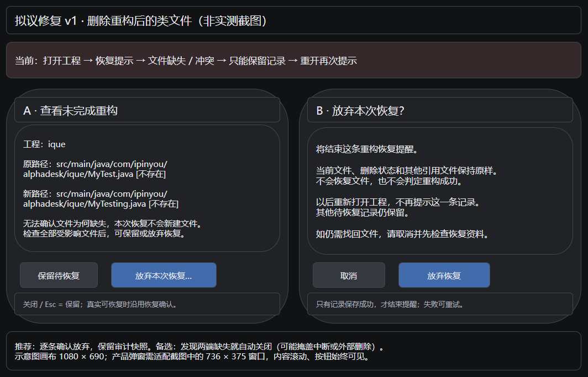

# Code Workspace：Java 类重构后删除文件，重开工程残留恢复提示的修复设计

## 1. 摘要、范围与状态

- 设计状态：**可实施**；本轮仅完成设计、源码调查和内存诊断，未修改产品代码，未完成修复后验证。
- 日期：2026-09-13；基线：`66dc56629b220eb9cdf250a2a54035c3b866b8b4`，应用版本 `0.4.24`。调查开始时 `git status --short` 为空。
- 来源：用户截图中的 `Refactor recovery pending`，以及用户明确补充“删除了重构后的 Java 类文件”。工程为 `D:/code/ads/ique`，类文件为 `MyTest.java → MyTesting.java`。
- 当前环境：Windows 11；兼容范围固定为 Windows/WebView2、macOS/WKWebView、Linux/WebKitGTK 三端 Tauri 桌面。
- 用户已选择图稿 v1：**逐条确认放弃恢复，保留当前删除状态**。没有待用户决策的实现前置。

推荐修复分为三部分：统一重构后置校验的路径身份，避免成功类重命名留下假失败记录；修正移动恢复使用错误内容哈希的问题；为历史待恢复记录增加明确的“放弃本次恢复”出口。放弃只结束所选记录的恢复提醒，不重建类文件，不修改引用文件，也不把未验证事务伪装成成功或回滚成功。

范围包括这条调用链的路径、恢复记录、缺失状态和提示显示。沿用当前 JDT LS、事务应用、Undo/Redo、文件操作和写盘通道，不引入新依赖、不清空 localStorage、不扩展为整个恢复中心重构，不更改 Safe Delete 的引用清理语义。

## 2. 事实、证据与因果链

### 2.1 用户事实与调查结果

1. 用户报告：关闭 Code Workspace 前做过类重构并删除重构后的 Java 文件，重开 ique 弹出恢复提示。删除入口、当时的重构返回结果、是否发生过异常关闭未知。
2. 用户截图：同一旧文件同时以 `D:/.../MyTest.java` 和 `D:\...\MyTest.java` 出现，移动目标为 `MyTesting.java`；长路径超出对话框右侧。截图只能证明提示已出现，不能证明事务曾真实失败。
3. 本轮只读检查：工程根仍存在；截图所列旧、新两个 Java 文件均不存在。未读取、修改真实工程内容或用户应用恢复存储。
4. 在当前源码运行内存诊断，确认两项算法缺陷和删除后的分类结果。脚本使用生产 journal preparation/classifier；shell 后置别名算法在脚本中按当前代码复刻，**不是挂载组件或原生 UI 复现**。

证据：[可重复诊断脚本](code-workspace-java-rename-deleted-recovery/diagnose.mjs)、[本轮诊断结果](code-workspace-java-rename-deleted-recovery/diagnostic-result.json)。用户截图来源为本会话 Image #1，原文件位于用户临时目录，未将真实截图作为新增仓库文件提交；跨机器交接以本节脱敏说明为依据，真机复测另采集隔离工程截图。

### 2.2 当前调用链及源码位置

行号以调查基线为准；实施时以符号定位。

| 位置 / 符号 | 当前行为与影响 | 依据 |
|---|---|---|
| `src-tauri/src/lsp.rs`：`path_from_uri`、WorkspaceEdit rename 解析（约 2804、10300 行） | 从 URI 转平台文件路径；Windows 可产生反斜杠形式 | 源码事实 |
| `src/components/editor/CodeWorkspaceTab.tsx:4536`：`readWorkspaceEditPathSnapshot` | 快照 `path` 经 `normalizeFsPath`；先返回打开的 buffer，再读磁盘；不能把该 API 当作纯磁盘 stat | 源码事实 |
| 同文件：`captureWorkspaceEditPathSnapshots`（约 4598 行） | 按 `fsPathComparisonKey` 去重，将 normalized path 传给快照读取 | 源码事实 |
| `workspace/refactorPlan.ts`：`prepareRefactorRecoveryJournalV2`、`recoveryMovePath` | 文本快照 canonicalPath 使用前置快照；move path 优先直接保留输入 path；`contentHash` 取文本修改前的内容 | 源码事实 |
| `CodeWorkspaceTab.tsx:9633`：后置校验 | `actualPostTexts[snapshot.path]` 建表，却以 `move.newPath`、`move.oldPath`、`doc.canonicalPath` 原字符串查表；缺失别名变成 unreadable，journal 进入 `recovery-required` | 源码 + 内存诊断 |
| `workspace/refactorPlan.ts:590`：`verifyRefactorPostHashes` | 找不到实际文本时直接 `continue`，`allMatched` 仍可为 true；不能独自作为完整后置证明 | 源码事实；修复时一并封闭漏检 |
| `workspace/refactorRecoveryController.ts`：`classifyRecoveryMove` | 新文件存在时用 `move.contentHash` 比较当前文本；两端缺失为 conflict | 生产函数内存诊断 |
| 同文件：`classifyRefactorRecoveryPreconditions` | 文本文件读不到为 unreadable；总状态 conflict 优先于 unreadable | 生产函数内存诊断 |
| `CodeWorkspaceTab.tsx:9967`：`promptRefactorRecoveryEntry` | 先提示，再分类；conflict/unreadable 仅提供保留。blocked 文案只列文本，遗漏 move 冲突明细 | 源码事实 |
| 同文件：自动 discover（约 10160 行）、`workspace.reviewRefactorRecovery`（约 14279 行） | 两处独立过滤 prepared/recovery-required；handled ID 只在当前实例有效，重开后再次提示 | 源码事实 |
| `workspace/useWorkspaceFileActions.ts`：`deleteSelected` | 文件删除与恢复 journal 是不同生命周期；当前没有结束重构恢复记录的契约 | 源码事实；不应在删除时直接全量清 journal |
| `src/lib/editor/workspace.ts`；`src-tauri/src/workspace.rs`；`src-tauri/src/lib.rs:519` 起 IPC 注册 | `workspace_list_dir/read_file/delete_path/rename_path` 执行真实文件副作用 | 已核对调用和注册；本方案不改 IPC |
| `src/components/sidebar/ConfirmDialog.tsx`；`src/lib/appDialogs.tsx` | 当前 confirm 文本容器使用 `whitespace-pre-line`，缺少完整长路径换行和受限高度布局 | 源码与截图一致 |

表中的 `workspace/` 简写均指 `src/components/editor/workspace/`。

历史资料 `claudedocs/code-workspace-idea-specs/idea-2026-followups.md` 的 ED-FOLLOW-001 要求类 rename 路径与内容双还原；仅作为相邻契约，不把历史完成状态当本次证据。现有 `TC-IDE-AUDIT-014-rename-recovery-native` 刻意重命名变量而非顶层类，后段使用注入 journal，因此无法证明此次类移动组合场景。

### 2.3 根因确定性

**RC-01：Windows 路径表示不一致导致假后置失败，已确认算法缺陷。**

触发：真实文本编辑与文件移动已完成 → snapshot key 为 `/`、move key 为 `\` → move 新路径读不到 → 无法为旧文本路径建立别名 → journal 后置校验判 unreadable → `recovery-required` → 重开提示。截图路径形态支持此解释，内存诊断 `movedTextFound=false`、`oldDocumentPostTextFound=false`。用户当时的 journal、写盘结果和日志未取得，不能断言该次记录一定由 RC-01 产生；真实中断或写盘失败仍是可能来源。

**RC-02：删除后无法终结旧恢复提醒，已确认现有行为缺口，目标行为由用户决定。**

用户删除重构后的文件 → 原路径本来已因 rename 消失，新路径也消失 → move=conflict，doc=unreadable → 保留 pending；关闭再开清空内存 handled 集合 → 再次提示。两端缺失不能证明用户主动删除，禁止自动恢复文件或自动当作事务成功。新增显式放弃出口解决历史记录，无须猜测删除意图。

**RC-03：混合文本修改与移动使用前置哈希恢复，已确认生产函数缺陷。**

`prepareRefactorRecoveryJournalV2` 保存 `contentHash=hash(preText)`；类名修改并移动后新路径为 `postText`。分类文本得到 restorable，分类 move 却 conflict，阻断正常恢复。现有 controller 测试直接构造 `contentHash=hash(moved-bytes)`，未串起 preparation。新增回归必须使用生产 preparation 生成 journal。

最小区分性后续检查：在 QA 副本中记录 JDT LS 的有序 text/rename 操作、事务后状态、`verification.failedEffects/mismatchedUris` 及磁盘 hash，比较统一路径修复前后结果。如可取得用户原记录，只读取该工程、该 recoveryId 的脱敏元数据，不清理真实存储；若原记录显示真实写盘失败，调整事故归因，RC-01/02/03 的已证实缺陷及修复任务仍成立。

## 3. 已定决策与有效图稿

| ID | 选项、代价 | 结论 / 理由 | 状态与来源 | 关联 |
|---|---|---|---|---|
| DEC-01 | 逐条确认放弃：多一步但不猜测删除意图；所有文件缺失即自动结束：操作少但可能隐藏中断；仅修误判：旧记录仍无出口 | 采用 v1，确认放弃、保留删除状态 | **用户已定**：2026-09-13 对图稿选项明确答复“采用图中方案：确认放弃恢复，保留删除状态” | AC-02/03/04；TASK-03；V-03/05 |
| DEC-02 | 改用 dismissed 顶层 status：旧版本 validator 不识别；增加可选 resolution：保留原事务事实、旧版本可继续读取 | 在 v2 entry 增加可选用户处理元数据，统一 pending 判断；不复用 committed/rolled-back | agent 自决，依据既有状态语义与旧数据兼容 | AC-03/04；TASK-03；V-03 |
| DEC-03 | 简单隐藏弹窗：无法修正事务错误；修正路径和内容证明：保持既有成功/失败契约 | 修 RC-01/03，未验证内容继续阻止覆盖 | agent 自决，依据代码与诊断，不引入新组件依赖 | AC-01/05/06；TASK-02/04；V-01/02 |

当前有效版本为 v1，已向用户展示并获得 DEC-01 选择；无后续实质改动。图稿是拟议行为，不是修复后截图。



[可编辑 draw.io 源稿](code-workspace-java-rename-deleted-recovery/recovery-v1.drawio)。画布标注为 1080×690；实际预览导出 1064×684。两张卡片展示前后相继步骤，不是产品中同时出现的两个窗口。用 draw.io CLI 导出并实际查看了预览；带嵌入数据的 PNG 导出无法被查看器解析，已移除，交付独立源稿与可读 PNG。

产品至少验证 736×375（用户截图）、1280×800 视口，默认对话框不超过 `min(640px, 92vw)`，高度不超过 `90vh`，正文滚动，底部操作固定；长路径按任意字符换行，不能只截断关键信息。可使用相对路径，但必须标清工程并提供可查看/复制的完整路径。

## 4. 验收契约

| ID | 前置与动作 | 必须观察到的结果 | 平台 |
|---|---|---|---|
| AC-01 | JDT LS 重命名顶层 `MyTest` 为 `MyTesting`，包含 text+rename；成功写入后重开 | 类名、引用与目标路径符合预览，旧路径消失，journal committed，无该记录的 pending；继续删除目标并重开仍无假提示 | 三端，Windows 混用分隔符为关键回归 |
| AC-02 | 历史 pending，旧新两端均缺失；打开/查看恢复 | 明确列出缺失的两端及其他受影响文件；不创建文件、不修改引用；保留与放弃均可达，不能声称恢复成功 | 三端 |
| AC-03 | 在 AC-02 选择放弃，二次确认 | 仅记录用户放弃；旧、新路径继续不存在，其他文件 bytes 不变；重开无该条提醒，其他 pending 正常提示 | 三端 |
| AC-04 | 取消/Esc、持久化失败、切换工程或并发更新同一 entry | 取消保留 pending；失败明确提示且可重试；过期对话框不能改新工程；不能覆盖更晚事务/恢复状态 | 三端 |
| AC-05 | 真正 pending，文件处于可证明的重构后状态，用户选择恢复 | 新文件移回旧路径，文本和引用恢复 preimage，经独立读回后才 rolled-back；重复执行幂等；第三方内容/缺失/不可读仍不覆盖 | 三端 |
| AC-06 | move 存在但对应后置文本缺失、文本校验不匹配、保存失败或权限错误 | 不得因路径修复或别名兜底判成功；保留实际失败证据，禁止注册成功 Undo | 三端 |
| AC-07 | 长绝对路径、多文件、低高度窗口、键盘操作 | 路径不溢出，所有受影响项可滚动查看；保留/放弃/恢复操作准确，焦点可达，关闭回编辑器 | 三端 WebView，指定两组视口 |

## 5. 修复方案

### 5.1 路径和后置校验（RC-01）

在 `refactorPlan.ts` 新增可单测的后置快照索引/解析 helper，供 shell journal 校验和 plan 校验共用。索引 key 一律为 `fsPathComparisonKey`，展示/IO 仍保留规范路径，不把比较 key 写回真实路径。复用 `codeWorkspaceModel.ts` 现有 file URI、drive、UNC、`.`/`..` 规则；POSIX 不全量 lower-case，不新增自行 decode URI 的逻辑。

后置文本解析必须基于事务中记录的有序 move：text doc 原身份 → 已执行后的目标路径 → snapshot。不能因旧路径尚有缓存就优先使用旧 buffer；缺失的旧路径是合法 rename 结果，必须同时证实新路径存在。按实际操作结果确认哪些 move 已完成；未执行、失败或不明确的 move 不得用无条件 alias 掩盖。对于链式移动遵循操作顺序，含糊映射 fail closed；不能取 basename 或任意同名文件兜底。

`verifyRefactorPostHashes` 必须将“要求校验但找不到文本”作为未验证失败，返回可区分的 missing/mismatch 明细；同步所有调用者和 TS 类型。后置文本仍复用 `refactorJournalPostImageMatches` 的既有 EOL 处理；同时让 plan 校验遵循相同实际保存规范，避免 CRLF 被一处接受、另一处拒绝。不能把 plan expected hash 缺失文档擅自扩大成新的必验文档。

成功要求全部所选文本后置条件可验证、所选资源效果可验证且无 failed/skipped/unknown 副作用。类型结果显式给出 verified count 和 missing 项，零验证文档不能代替有预期文本的计划成功。纯 move 需要端点证明。保持真正失败继续进入 recovery-required。

写入新 move 的 old/new path 时可规范化显示，但读取历史未规范化 entry 必须也正确；不能仅修 writer，留下旧记录无法恢复。缓存键、document 与 move 匹配统一用身份比较函数。

### 5.2 恢复内容证明（RC-03）

保留现有 v2 `resourceMoves.contentHash` 的旧语义，不原地改成 postHash。新增内部 `resolveRecoveryMoveProof`（拟新增符号），从与 move 匹配的 journal document 推导允许的 pre/post 内容：

- 移动前/后文本尚未应用或部分恢复时，可接受该 document 已记录的 preimage；文本修改已完成时，可接受 postimage；两者都需经过编码/EOL 规则验证。
- 存在完整 document 时，以 document 的 pre/post 证明为权威，不能只与 move.contentHash 比较。
- 纯 move 无 document 时沿用已有 contentHash；无 hash 的历史条目保持 content-unverified 标记，不升级成已验证内容。
- 多份 document 无法唯一关联、移动链阶段不能确定时标 conflict/unreadable 并显示原因；不猜测。验证源包括 preparation 生成的 journal，不能只靠手填 fixture。

移动前重新读端点与源内容，记录这次实际匹配的 hash；逆移动之后独立读旧路径，与**这次移动前的实际 hash**比较，以证明移动未改变内容。之后才通过原文本恢复路径写 preText，再逐文档读回验证 preHash。最终必须同时满足路径和文本条件，才能 rolled-back。

同时核对 `resolveRecoveryDocTarget`、shell `restoreText/readBack`：文档可能以旧路径或新路径记录；逆移动后都应落到实际旧路径。不能在 move 失败后继续对该 move 关联文档写盘。保留无关文档的当前恢复策略，不扩大部分恢复语义。

恢复存在性须区分磁盘缺失、不可读和仍打开的 buffer。复用 `workspaceListDir/workspaceReadFile` 真实后端读取，在 recovery hooks 增加专用磁盘快照路径；不直接改变共享 `readWorkspaceEditPathSnapshot` 的 buffer 优先契约。若文件磁盘缺失而 buffer 尚存，显示该差异并阻止自动复活文件；有 dirty buffer 的恢复不得覆盖用户未保存内容。缺失父目录、权限错误、非普通文件、无法读取分开处理，任何不确定性都不能触发自动结束记录。

### 5.3 显式放弃与持久化（RC-02，DEC-01/02）

持久化仍为 `taomni.refactor.recovery.v2:<recoveryId>`，拟扩展：

```ts
// RefactorRecoveryJournalEntryV2 的可选字段，旧 entry 缺省仍为未处理。
resolution?: {
  kind: "user-dismissed";
  resolvedAt: number;
  reason: "keep-current-state";
};
```

`status`、pre/post snapshots、resourceMoves、verification 保持原事实。放弃不清除 journal，也不伪造 committed/rolled-back。复用 typed `RefactorJournalWriteResult`；持久化失败不可显示“已放弃”。validator 兼容字段缺省，有字段则验证值；不批量迁移。旧版本读取时会忽略新可选字段并再次提示，属于代码回退限制，但恢复资料仍可读；不能承诺跨版本永久免提醒。

新增 `isPendingRefactorRecoveryEntry(entry)`：status 为 prepared/recovery-required 且无有效 user-dismissed resolution。自动 discover、命令面板入口及相关状态展示只通过该 predicate 判断，不复制过滤表达式。

新增局部 `dismissRefactorRecoveryEntry` 操作：二次确认后重新取得同 recoveryId、workspaceRoot、transactionId 的最新 entry，核对 expected updatedAt 及实例所有权；确认其仍 pending、没有正在 apply/recover 的同一事务，再只添加 resolution 并写回。写前比较和写入不得跨 await；UI owner 对同一 entry 的恢复/放弃互斥。版本改变时刷新展示、要求重新选择，不覆盖其他更新。此处防当前应用实例内旧响应；不声称 localStorage 能提供多进程 CAS。

取消/Esc/关闭只取消当前提示，保留 pending；下一次打开仍可提示，命令面板可在本次打开中再次查看。放弃成功后，仅从 pending 展示中移除所选条目；继续处理其他 pending，不清空 handled 集合。失败留在对话框可重试；处理成功后再更新 handled 状态。工作区切换/卸载释放对话框请求并丢弃旧响应，不对新实例写状态。

### 5.4 UI、状态与接口

新增局部 `RefactorRecoveryReviewDialog.tsx`，复用工程现有对话框样式/焦点机制，避免为这个列表改造整个全局 confirm API。原入口 `Review recovery` 可保留；进入后展示图稿 A 状态。classify 可给更细 reason（例如 `both-missing`、`both-present`、`content-changed`、`read-failed`），保持 conflict/unreadable 大类供执行器保护。

| 状态 / 动作 | 下一状态及结果 |
|---|---|
| 打开 review | 加载/核对中；仅关闭可用，完成前不允许恢复或放弃 |
| missing/conflict/unreadable | 列出全部文本及 move 两端真实状态，恢复禁用；保留、放弃入口可用 |
| restorable | 可恢复，沿用“Restore pre-refactor content”二次确认；也允许用户明确放弃，显示整条事务影响 |
| already-restored | 经完整路径/内容证明并持久化成功后结束为 rolled-back；失败仍留 pending |
| 点击放弃 | 展示图稿 B 二次确认，默认焦点在取消；显示影响文件总数、保留现状及仅结束本记录的含义 |
| 确认且保存成功 | 关闭该条提醒，状态栏提示已放弃本次恢复；文件无副作用 |
| 确认失败 / entry 变化 | 保留可见错误和记录，允许重试或返回刷新后的 review |
| 切换工程 / 关闭工作区 | 请求撤销，旧异步结果不提交状态，焦点回归当前有效界面 |

界面不能把“读不到”显示成“用户已删除”；两个端点均不存在时只写“文件不存在”。去重展示同一 document/move 资源时按路径身份关联，在一行中保留旧→新关系，不能漏掉其他引用文件。正文中的“放弃”是整条事务，不允许只放弃一个文件却关闭整条记录。

拟新增组件契约：`entry`、`preconditions/loading/error`、`onKeep`、`onRestore`、`onDismiss`；异步执行和持久化仍由 CodeWorkspaceTab owner 管理。二次确认复用现有 app dialog，不新增 IPC/全局 store。窗口小尺寸时使用正文滚动和完整路径换行；aria 标题关联、focus trap、Esc、按钮 disabled、关闭后焦点恢复必须覆盖。产品文案按现有语言约定接入，图稿中文用于设计沟通。

### 5.5 三端与回退

没有新增 Rust `cfg` 或平台依赖。路径比较沿用现有 Windows drive/UNC 大小写规则及 POSIX 大小写区分，不把 Windows key 当真实目标路径，也不假设所有 macOS 卷大小写不敏感。原生 IO 仍经 Rust workspace 边界；只读 stat/read 也需保留根内约束和权限错误。

现有 browser stubs 只用于提示、组件生命周期与注入失败，不能证明磁盘删除、JDT LS file move 或 WebView localStorage 重启持久化。代码回退不会找回用户主动删除的类；resolution 被旧代码忽略会再提醒，但原恢复快照仍保留。不得为回退清空恢复存储或运行真实文件恢复。已有真实异常 entry 不能仅因当前文件等于 postText 就自动改 committed：此前写盘是否成功仍可能不明。

## 6. 改动清单与任务交接

所有任务为待执行，并未分配/启动其他 agent。后续执行者应保留其他人的改动；共享的 `CodeWorkspaceTab.tsx` 由 TASK-05 集成负责人协调顺序。

| TASK | 职责 / 文件 | 具体工作与依赖 | 完成条件 |
|---|---|---|---|
| TASK-01 回归与事件取证 | `refactorPlan.test.ts`、`refactorRecoveryController.test.ts`、`CodeWorkspaceTab.test.tsx`；本设计证据目录 | 无前置。读取 §§2/4/5，使用真实 preparation 构造混合 edit；增加旧实现失败的路径 lookup、pre/post move proof、删除重开场景；在 QA 工程收集操作顺序和事务事实。有原事故 journal 则补元数据，不将其作为已证实修复的硬阻塞 | V-01/02 原实现失败点可重现，说明 mock 边界；原事故归因仍无证据时保持不确定性 |
| TASK-02 后置校验 | `refactorPlan.ts`、对应 test；`CodeWorkspaceTab.tsx` 后置快照与 summary 区域 | 依赖 TASK-01 契约。实现身份索引与有序 move 解析、missing 失败、EOL 一致校验、资源后置证明；核对全部 `verifyRefactorPostHashes` 调用者 | AC-01/06，V-01/04；成功记录不 pending，真实失败不被吞掉 |
| TASK-03 放弃记录及提示 | `refactorPlan.ts` entry/validator/predicate/dismiss helper；`CodeWorkspaceTab.tsx` review/discover/action；拟新增 `RefactorRecoveryReviewDialog.tsx` 和 `.test.tsx` | 依赖 DEC-01（已定），可与独立路径算法顺序集成。实现 resolution、存储错误/版本守卫、选择后确认、长路径展示及 owner 清理；更新自动与手动入口 | AC-02/03/04/07，V-03/04；只结束目标记录，零文件写入，图稿一致 |
| TASK-04 恢复证明 | `refactorRecoveryController.ts`、`refactorPlan.ts` target/proof helper、对应 test；`CodeWorkspaceTab.tsx` recovery hooks | 依赖 TASK-01，读取 §5.2。串起 preparation 和 classifier/executor，修 pre/post proof、逆移动后读回与文档映射；增加恢复专用磁盘读取，禁止关联 move 失败后的文本写入 | AC-05/06，V-02/04；路径+文本双还原且 third-party/dirty/missing 不覆盖 |
| TASK-05 集成、QA 与证据回填 | 上述共享文件集成；拟新增 `qa-ui-auto-tests/cases/TC-IDE-JAVA-RENAME-DELETED-RECOVERY.testcase.yaml`；`qa-ui-auto-tests/feature-list.md` 及生成 catalog；本设计 §9 | 依赖 TASK-02/03/04。按 qa-ui-auto 技能登记 F25.5 用例与 controls，读 authoring/verb catalog 再写 YAML；执行自动化、Windows 原生主流程及相邻 Undo/Redo/恢复，保留三端接续计划 | 所有 AC，V-04/05/06；回填真实结果、构建与 skip；不能从旧变量 rename 测试推导本问题通过 |

文件表未列 backend 修改：若 TASK-01 发现现有 IPC 无法表达必要的缺失/不可读区别，先评估以现有 listing state 实现；只有证据证明需要扩展时再记录接口变更和对应 Rust 测试，不无依据扩大范围。

## 7. 自动化验证计划

以下为修复后验收计划，全部待执行。本轮基线测试和诊断见 §9。

| V | AC | 用例 / 层级 | 输入、动作与业务断言 |
|---|---|---|---|
| V-01 | AC-01/06 | `refactorPlan.test.ts` + mounted `CodeWorkspaceTab.test.tsx` | Windows `/`、`\`、drive 大小写、file URI、UNC，同一资源正确关联；POSIX 大小写不同不得误合并。text+move 使用真实 preparation；成功 post→committed，missing/错误内容/失败 move→pending。CRLF/BOM 按原契约，链式移动按顺序或明确拒绝 |
| V-02 | AC-05/06 | `refactorRecoveryController.test.ts` | 从 preparation 构造 journal，pre/post 状态分别 classify；真实内存磁盘模型校验逆移动、文本及引用 preimage、重复恢复幂等；两端缺失/都存在/第三方修改/读取拒绝/移动失败不破坏内容；新路径记录的 doc 在逆移动后仍正确恢复 |
| V-03 | AC-02/03/04/07 | journal tests、拟新增 `RefactorRecoveryReviewDialog.test.tsx`、mounted shell | 注入旧 v2 pending 和新 resolution；放弃取消、确认、quota exception、stale version、switch/unmount、多个 entry；断言重新挂载后目标不提示、其他记录仍提示，所有磁盘写/rename/delete hooks 未执行且模型内容不变。dialog mock 不能替代实际 UI 几何检查 |
| V-04 | AC-01/04/05/06 | 全部受影响 Vitest + frontend build | 成功类 rename 的 Undo/Redo 单次事务、变量 rename、多文件 Replace 的真实失败状态、恢复重试、编码保存与已有 54 项相邻回归；修复后通过且没有新增 skip |
| V-05 | 全部 | Windows 原生新 YAML / 手工 QA；macOS、Linux 接续 | 真实 JDT LS text+rename → 删除 → 重开；历史 pending → 放弃 → 重开；可恢复 pending → 确认 → 路径与 bytes 双恢复；真实 WebView 小窗口长路径 |
| V-06 | AC-02/03/07 | QA 静态 audit/catalog | F25.5 controls/covers/case 一致，新 case 不冒充运行通过，未执行的平台有独立状态 |

执行目录为仓库根，PowerShell：

```powershell
pnpm test src/components/editor/workspace/refactorPlan.test.ts src/components/editor/workspace/refactorRecoveryController.test.ts
pnpm test src/components/editor/CodeWorkspaceTab.test.tsx
# 以下文件为 TASK-03 新增后使用
pnpm test src/components/editor/workspace/RefactorRecoveryReviewDialog.test.tsx
pnpm build
$env:PYTHONPATH = ".agents/skills/qa-ui-auto/scripts"
python -m qa_ui_auto audit --gate
```

已核对 package.json：`pnpm test` 是 `vitest run`，`pnpm build` 是 `tsc -b && vite build`。本次未规划 Rust 生产修改，默认不跑无关全量 Cargo 集成；如追加 Rust 边界变更，在 `src-tauri/` 执行 `cargo test --lib workspace::`，macOS 必须先在根目录 `bash scripts/bundle-krb5-macos.sh stage`，仅格式化所改 Rust 文件。

现有 UI 映射：F25.5；`refactoring-preview-dialog`、`refactoring-preview-apply`；`workspace.reviewRefactorRecovery` 是命令 action ID，不是 testid。新 case ID 已在调查基线查重，尚未登记。拟新增 dialog testid：`refactor-recovery-review`、`refactor-recovery-resource`、`refactor-recovery-keep`、`refactor-recovery-dismiss`、`refactor-recovery-restore`。TASK-05 在写 selectors 前核对实际实现与二次确认对话框，不在设计里编造已存在 selector。本轮不新增执行 YAML 或修改共享看板。

## 8. 三端真机复测手册（V-05）

### 8.1 构建与环境

使用独立构建的 `com.taomni.app.qa` / Taomni QA，不能更名生产二进制充当 QA。根目录运行：

```powershell
python .agents/skills/qa-ui-auto/scripts/native_build.py
$env:PYTHONPATH = ".agents/skills/qa-ui-auto/scripts"
# TASK-05 新增并校验 case 后使用；先准备本平台 config 与依赖
python -m qa_ui_auto run --mode native --filter TC-IDE-JAVA-RENAME-DELETED-RECOVERY --require-pass
```

`native_build.py` 生成的独立构建位于 `src-tauri/target/qa-ui-auto/debug/taomni.exe`（Windows），身份记录为邻接 `.qa-identity.json`；由 runner 验证来源和 hash。本轮未执行这些构建/原生命令。自动化能力不全时，同一 QA 构建使用录制的手工 UI 步骤；仍需独立 app-data 和一次性工程。

| 平台 | 真实依赖与准备 | 本轮状态 / 接续 |
|---|---|---|
| Windows（当前） | 记录系统架构、WebView2 版本；Rust 1.94+、protoc、完整 Perl/Bash 及 Tauri 构建环境；tauri-driver 与匹配 WebView2 的 msedgedriver；JDK、JDT LS、Maven 就绪 | **未执行原生复测**，实现后由 TASK-05 完成；本轮只有源码/内存诊断 |
| macOS | 对应架构的 QA 构建，WKWebView；JDK/JDT LS/Maven；Cargo 前 stage krb5；验证 CFBundleIdentifier。无 Tauri WebDriver，用 OS 自动化或录制手工流程 | **未验证**；在 macOS QA 设备执行同一流程，记录真实大小写敏感性及 Cmd/Meta 操作 |
| Linux | 对应架构 QA 构建，GTK/WebKitGTK、tauri-driver/WebKitWebDriver，X11 或 Xvfb；JDK/JDT LS/Maven | **未验证**；Linux QA 环境执行同一流程，记录大小写与文件权限分支 |

使用隔离的源码合法 Maven 单模块工程，新建 `MyTest.java` 和一个引用该类的调用者，放在 fixture 自己的目录，不操作 `D:/code/ads/ique`。每个平台记录被测 commit、dirty diff、二进制 SHA-256、JDK/JDT LS/Maven 版本、profile 路径和 fixture 根。状态栏 Java ready 并能取得真实 rename WorkspaceEdit 才算 provider 就绪，不能只等固定秒数或用 browser fixture 冒充。

### 8.2 主流程与逐步断言

1. **先证明成功重构（AC-01）**：QA 中打开 MyTest，把光标置于顶层类名，执行 Rename/预览并应用为 MyTesting；收集 JDT LS text+rename 操作。检查新文件类名、调用者引用、旧路径不存在、journal committed、单次 Undo/Redo 路径与内容一致。关闭工作区并重开，不出现该事务的 pending。
2. **复测用户顺序（AC-01/02）**：重新成功 rename 后，用工程树删除 MyTesting.java 并确认；只检查删除对应文件，不把因调用者仍引用它产生的 Java 编译错误当恢复失败。关闭标签重开，再退出 QA 重启重开；旧/新路径继续缺失，不出现本次成功事务的假恢复提示。
3. **旧记录处理（AC-02/03）**：仅在隔离 QA profile 注入与基线诊断同构的 v2 pending（明确标注 seeded，不作为真实崩溃证据），对应旧/新文件都缺失，调用者及另一 pending 条目保留。打开工程、Review，检查缺失状态和全部受影响文件；先取消放弃，重开仍 pending；再确认放弃。比较操作前后目录清单/文件 hash：零文件变化；重启后只该 entry 不再提示，另一 pending 仍可见。
4. **真正恢复（AC-05）**：新隔离副本，以 production preparation 生成的 pending 和实际 postText/newPath 状态开始。点恢复，证明新路径消失、旧路径存在、旧内容和引用 preimage 独立读回一致，最后才 rolled-back。另做第三方修改与只读/不可读场景，必须阻止覆盖并给出具体原因。
5. **故障/退出（AC-04/06）**：组件层确定性注入 storage 写失败及旧请求；原生复核关闭/切换工作区不会把旧对话框结果应用到新工程。模拟真实写盘失败需记录方法与实际错误，不能把 seeded pending 记为执行了写盘失败。
6. **显示（AC-07）**：736×375、1280×800 下查看长路径和多文件，正文可滚动、完整路径可查看、按钮始终可见；Tab/Shift+Tab/Esc 与恢复焦点正常，截图检查不能仅看控件存在。

证据放 `qa-ui-auto-report/java-rename-deleted-recovery/<platform>/<run>/`（不提交），包括实际 command/manual steps、summary 中 pass/fail/skip、截图/录屏、脱敏 journal 元数据、rename edit、操作前后树与文件 hash。说明 hash 是文件 bytes 还是解码文本，不混为一种证据。每个平台分别填结果；测试选中 0 项、skip 或 browser stub 不算原生通过。

清理：退出本轮 QA 与自己启动的 provider/driver，只清理已核对位于本轮 fixture/report 下的一次性资源，保留证据；不清理生产 profile 或真实 ique。Windows 递归操作前检查 resolved absolute path 的边界。

## 9. 实际证据与交付追踪

本轮已执行：

| 项目 | 实际结果 | 证明范围 |
|---|---|---|
| 只读检查 ique 根和两个路径 | root=true，oldFile=false，newFile=false | 仅调查当时存在性，不证明删除动作时机 |
| `node docs-issue/code-workspace-java-rename-deleted-recovery/diagnose.mjs` | exit 0；alias lookup 两项 false；已完成 text+move 为 document restorable / move conflict；删除后为 document unreadable / move conflict | 生产 preparation/classifier 的内存边界；shell lookup 为源码算法复刻，无 native UI |
| `pnpm test src/components/editor/workspace/refactorPlan.test.ts src/components/editor/workspace/refactorRecoveryController.test.ts` | 2 文件、54 测试通过，0 skip | 基线相邻测试，不证明修复已完成；测试数据缺少 preparation→混合移动的组合覆盖 |
| draw.io v1 预览 | 已实际查看，文字/按钮可读，无明显重叠；用户选定 DEC-01 | 设计图稿与交互选择，不是 UI 实测 |

诊断脚本初次运行误用了原始 LSP `documentChanges`，内部 API 需要归一化 `operations`，曾失败于 `documentEdits.map`；修正输入后才取得链接中的最终结果。该失败是诊断脚本输入错误，不列为产品缺陷。脚本是保留基线问题的诊断资料，不代替实现期回归测试；算法变化后应以 V-01/02 正式测试判断修复。

| AC | 方案 | 任务 | 验证 / 所需证据 | 当前状态 |
|---|---|---|---|---|
| AC-01 | §5.1 | TASK-01/02/05 | V-01/04/05，真实 text+rename、committed、重开无提示 | 未实现；Windows/macOS/Linux 原生均未验证 |
| AC-02 | §5.3/5.4 | TASK-03/05 | V-03/05/06，缺失列表与无文件变化 | 设计已定；未实现 |
| AC-03 | §5.3 | TASK-03/05 | V-03/05，resolution、重启、另一 pending 保留 | 设计已定；未实现 |
| AC-04 | §5.3/5.4 | TASK-03/05 | V-03/04/05，取消/失败/过期请求结果 | 待执行 |
| AC-05 | §5.2 | TASK-01/04/05 | V-02/04/05，旧路径与 preimage 双证明 | 已证实原分类缺陷；修复待执行 |
| AC-06 | §5.1/5.2 | TASK-02/04/05 | V-01/02/04/05，失败证据与零误报成功 | 待执行 |
| AC-07 | §5.4、v1 | TASK-03/05 | V-03/05/06，两组视口及键盘实测 | 仅完成拟议图查看；产品未验证 |

实施交付需相关自动化检查、三端代码兼容审查及 Windows 真机流程完成，且无已知其他端代码不兼容；macOS/Linux 无设备不阻塞 Windows 本轮实施交付，但必须继续标未验证，不宣称三端实测通过。本轮是设计交付，不以这些待执行项冒充实现完成。

## 10. 风险、缺口与开始条件

- 用户原事故 journal 未取得，因此**原事故最初为何 pending 仍待归因**；不阻塞已确认路径/证明缺陷和用户已定恢复出口的实施。TASK-01 负责补证据，不要求用户重复提交敏感完整快照。
- “文件都不存在”不是事务完成证明；放弃必须明确确认整条记录，不把自动删除记录、自动还原文件作为快捷修复。
- 恢复快照保留在既有 localStorage 中，仍受既有配额限制；只新增小型 resolution 元数据，写失败留 pending。此次不增加自动清理/归档系统。
- 当前快照 API 混合 buffer 与 disk，TASK-04 必须分清证明来源；否则存在磁盘文件已删但缓存仍在的误判风险。
- 旧版本忽略 resolution 后可能再提示。恢复边界保持 fail closed，回退不能伪造用户文件重建。

现在可开始 TASK-01，以及按已定契约实施 TASK-03 的独立 journal/UI 部分；TASK-02/04 在相应回归固定后推进，TASK-05 最后集成验收。**无待用户决定的阻塞；用户真实旧记录的起因和三端原生结果仍明确未验证。**
